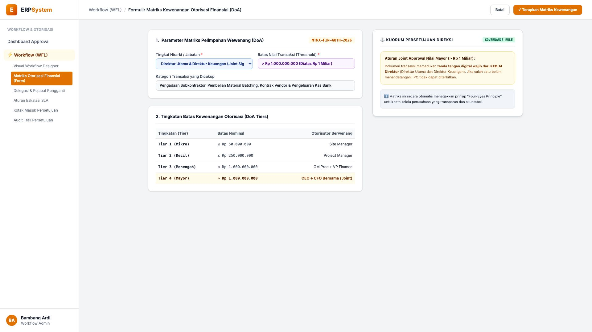
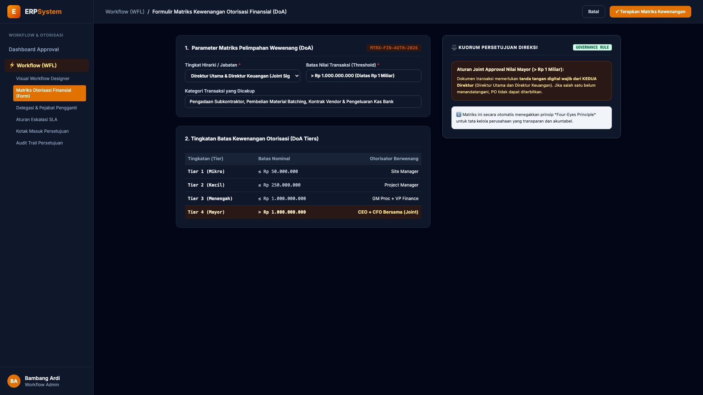

# 🎨 Design UI — Formulir Matriks Otorisasi Finansial (DoA) (Data Entry Screen)

> Mockup antarmuka **Formulir Konfigurasi Matriks Kewenangan Otorisasi Finansial (Delegation of Authority / DoA Matrix Data Entry)**: desain *Split-Screen Form* dengan formulir pengaturan tingkatan batas nominal di sebelah kiri (Nomor Matriks `MTRX-FIN-AUTH-2026`, kategori pengadaan & pengeluaran kas, 4 Tier Kewenangan: Tier 1 &le; Rp 50 Jt Site Manager, Tier 2 &le; Rp 250 Jt Project Manager, Tier 3 &le; Rp 1 Miliar GM Proc & VP Finance, Tier 4 &gt; Rp 1 Miliar Direktur Utama CEO + CFO Bersama / Joint Sign) dan *Live Kartu Aturan Kuorum Persetujuan Direksi (Four-Eyes Governance Principle) & Kewajiban Dual Sign Digital* di sebelah kanan pada modul `WFL` (Workflow & Approval Matrix Engine) dalam ERP System.

---

## Light Mode

---

## Dark Mode

---

## 📝 Komponen & Fitur Formulir Input

1. **Panel Kiri — Formulir Parameter Hirarki & 4-Tier DoA**:
   - Kode Matriks: `MTRX-FIN-AUTH-2026` &bull; Modul: `Finansial, Proyek & Pengadaan`.
   - 4 Tingkatan Nilai Transaksi:
     - **Tier 1 (&le; Rp 50.000.000)**: Site Manager
     - **Tier 2 (&le; Rp 250.000.000)**: Project Manager
     - **Tier 3 (&le; Rp 1.000.000.000)**: GM Procurement + VP Finance
     - **Tier 4 (&gt; Rp 1.000.000.000)**: Direktur Utama (CEO) + CFO (Joint Sign).

2. **Panel Kanan — Aturan Kuorum Persetujuan Direksi**:
   - Penegakan *Four-Eyes Principle* untuk transaksi nilai mayor.
   - Kunci Validasi Dokumen: PO tidak dapat terbit tanpa kedua tanda tangan Direktur.
