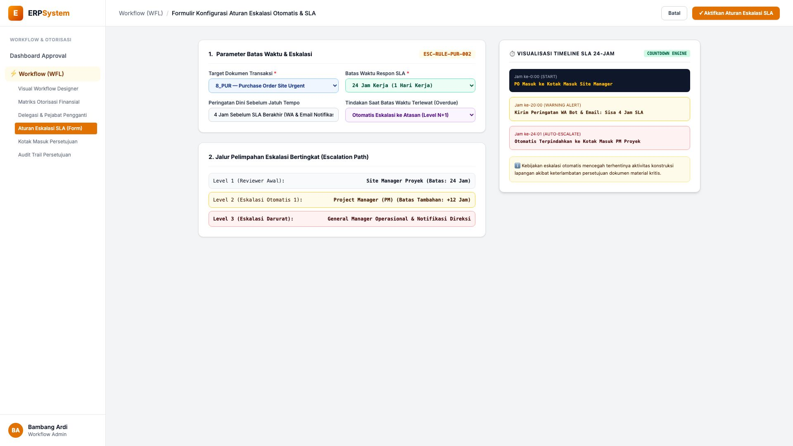
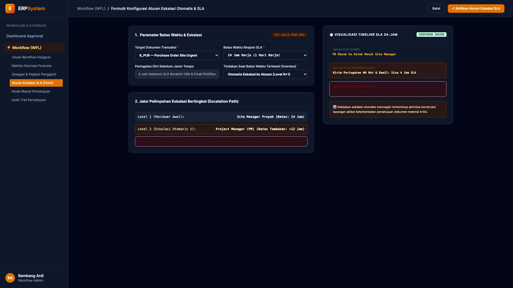

# 🎨 Design UI — Formulir Aturan Eskalasi Otomatis & SLA (Data Entry Screen)

> Mockup antarmuka **Formulir Konfigurasi Aturan Eskalasi Otomatis & SLA (SLA Escalation Rule Config Data Entry)**: desain *Split-Screen Form* dengan formulir batas waktu respon & jalur eskalasi di sebelah kiri (Nomor Aturan `ESC-RULE-PUR-002`, dokumen `8_PUR` PO Site Urgent, target SLA 24 jam kerja, early warning 4 jam sebelum jatuh tempo via WA Bot & Email, tindakan overdue auto-escalate ke Level N+1, 3 tingkatan jalur eskalasi: Site Manager 24 Jam &rarr; PM Proyek +12 Jam &rarr; GM Operasional & Notifikasi Direksi) dan *Live Pratinjau Skema Timeline Countdown SLA 24-Jam (Jam 0 Masuk &rarr; Jam 20 Warning Alert &rarr; Jam 24:01 Auto-Escalate)* di sebelah kanan pada modul `WFL` (Workflow & Approval Matrix Engine) dalam ERP System.

---

## Light Mode

---

## Dark Mode

---

## 📝 Komponen & Fitur Formulir Input

1. **Panel Kiri — Formulir Parameter SLA & Jalur Eskalasi**:
   - Kode Aturan: `ESC-RULE-PUR-002` &bull; Target: `PO Site Urgent`.
   - Durasi SLA: **24 Jam Kerja (1 Hari Kerja)**.
   - Peringatan Dini: **4 Jam Sebelum Expired (WA Bot & Email)**.
   - Tindakan Keterlambatan: **Auto-Escalate ke Atasan (Level N+1)**.
   - 3 Tahapan Eskalasi Jalur Darurat.

2. **Panel Kanan — Visualisasi Timeline Countdown SLA**:
   - Skema Waktu Nyata dari Masuk Dokumen hingga Eskalasi Otomatis.
   - Pencegahan Bottleneck Operasional Lapangan Proyek.
