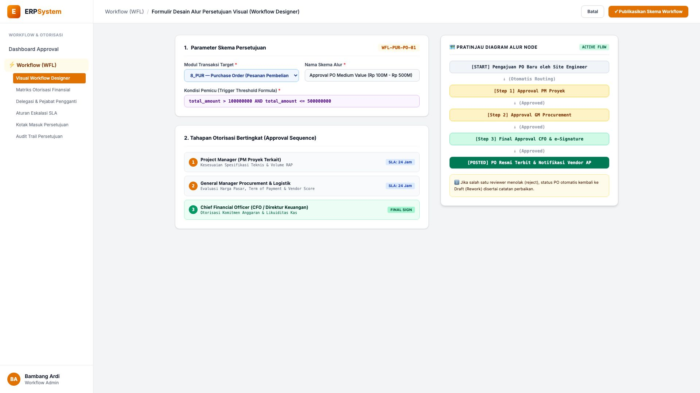
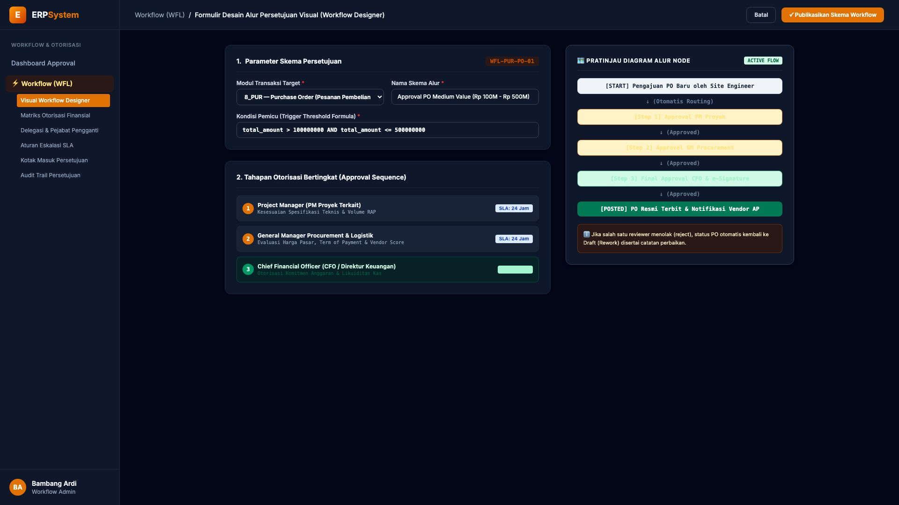

# 🎨 Design UI — Formulir Desain Alur Persetujuan Visual (Workflow Designer) (Data Entry Screen)

> Mockup antarmuka **Formulir Desain Alur Persetujuan Visual (Visual Workflow Designer Data Entry)**: desain *Split-Screen Form* dengan formulir konfigurasi alur bertingkat di sebelah kiri (Nomor Skema `WFL-PUR-PO-01`, modul `8_PUR` Purchase Order nilai medium Rp 100 Jt s.d Rp 500 Jt, formula trigger `total_amount > 100000000 AND total_amount <= 500000000`, 3 tahapan sekuensial: Step 1 Project Manager teknis & volume RAP SLA 24 jam &rarr; Step 2 GM Procurement & Logistik vendor & harga SLA 24 jam &rarr; Step 3 CFO Final Sign komitmen kas) dan *Live Pratinjau Diagram Alur Node Visual (START &rarr; Step 1 PM &rarr; Step 2 GM Proc &rarr; Step 3 CFO &rarr; POSTED Resmi)* di sebelah kanan pada modul `WFL` (Workflow & Approval Matrix Engine) dalam ERP System.

---

## Light Mode

---

## Dark Mode

---

## 📝 Komponen & Fitur Formulir Input

1. **Panel Kiri — Formulir Parameter Skema & Tahapan Sekuensial**:
   - Kode Skema: `WFL-PUR-PO-01` &bull; Modul: `8_PUR (Purchase Order)`.
   - Formula Kondisi: **Rp 100 Jt &lt; Nilai PO &le; Rp 500 Jt**.
   - 3 Tahap Persetujuan:
     - 1. **Project Manager**: Verifikasi kesesuaian teknis & RAP.
     - 2. **GM Procurement**: Verifikasi harga wajar pasar & penilaian rekanan.
     - 3. **Chief Financial Officer (CFO)**: Otorisasi komitmen kas & e-Sign.

2. **Panel Kanan — Diagram Alur Node Interaktif**:
   - Visualisasi Flowchart Node Persetujuan Otomatis.
   - Aturan Otomatis Rejection / Rework ke Pembuat Dokumen.
