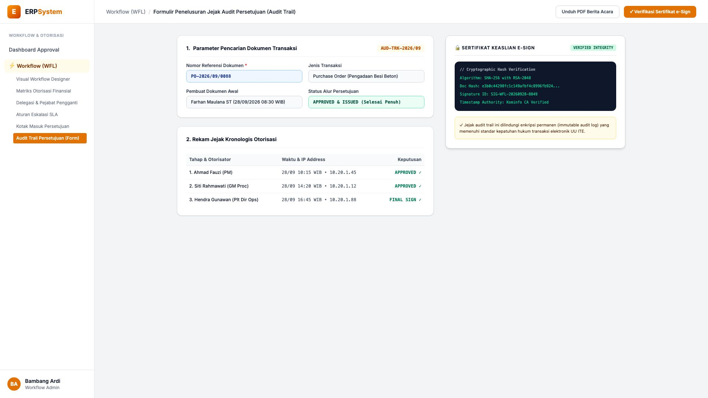
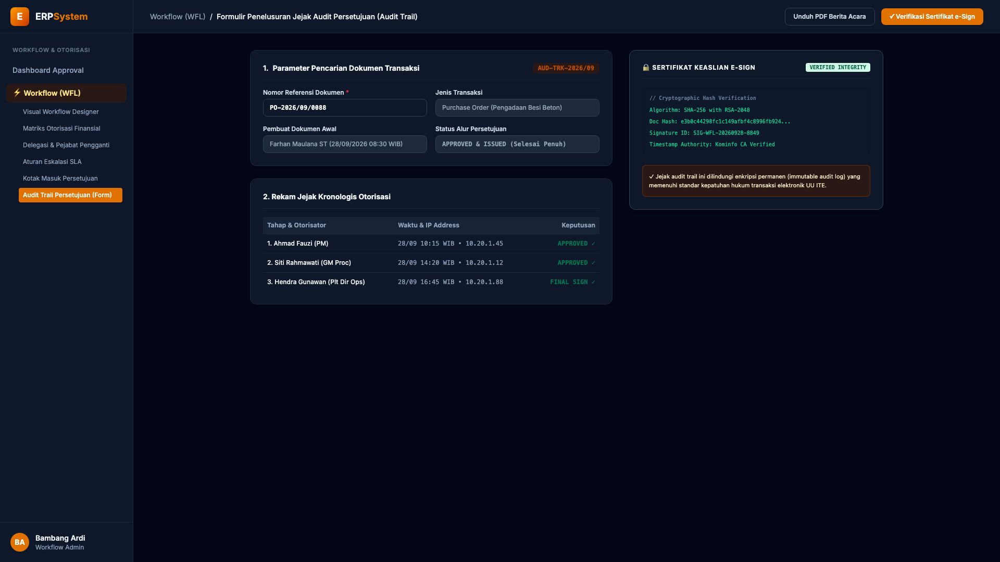

# 🎨 Design UI — Formulir Jejak Audit Persetujuan (Data Entry Screen)

> Mockup antarmuka **Formulir Penelusuran Jejak Audit Persetujuan (Workflow Audit Trail & Cryptographic Verification Data Entry)**: desain *Split-Screen Form* dengan formulir pencarian rekam jejak di sebelah kiri (Nomor Dokumen `PO-2026/09/0088`, jenis transaksi PO Pengadaan Besi Beton Rp 450 Jt, pembuat dokumen Farhan Maulana ST 28/09/2026 08:30 WIB, status final APPROVED & ISSUED, tabel kronologis 3 tahap: Step 1 Ahmad Fauzi PM 10:15 WIB IP 10.20.1.45 &rarr; Step 2 Siti Rahmawati GM Proc 14:20 WIB IP 10.20.1.12 &rarr; Step 3 Hendra Gunawan Plt Dir Ops 16:45 WIB IP 10.20.1.88) dan *Live Pratinjau Sertifikat Keaslian Tanda Tangan Digital (SHA-256 with RSA-2048, Timestamp Authority Kominfo CA Verified & Immutable Log)* di sebelah kanan pada modul `WFL` (Workflow & Approval Matrix Engine) dalam ERP System.

---

## Light Mode

---

## Dark Mode

---

## 📝 Komponen & Fitur Formulir Input

1. **Panel Kiri — Formulir Parameter Pencarian & Tabel Kronologis**:
   - Kode Penelusuran: `AUD-TRK-2026/09` &bull; Dokumen: `PO-2026/09/0088`.
   - Jejak Kronologis Otorisasi:
     - 1. **Ahmad Fauzi (PM)** &bull; 28/09 10:15 WIB &bull; IP: `10.20.1.45`
     - 2. **Siti Rahmawati (GM Proc)** &bull; 28/09 14:20 WIB &bull; IP: `10.20.1.12`
     - 3. **Hendra Gunawan (Plt Dir Ops)** &bull; 28/09 16:45 WIB &bull; IP: `10.20.1.88`.

2. **Panel Kanan — Sertifikat Kriptografi Digital e-Sign**:
   - Algoritma Enkripsi: **SHA-256 with RSA-2048**.
   - ID Tanda Tangan: **SIG-WFL-20260928-8849**.
   - Kepatuhan Regulasi: *Memenuhi standar legalitas transaksi elektronik UU ITE*.
