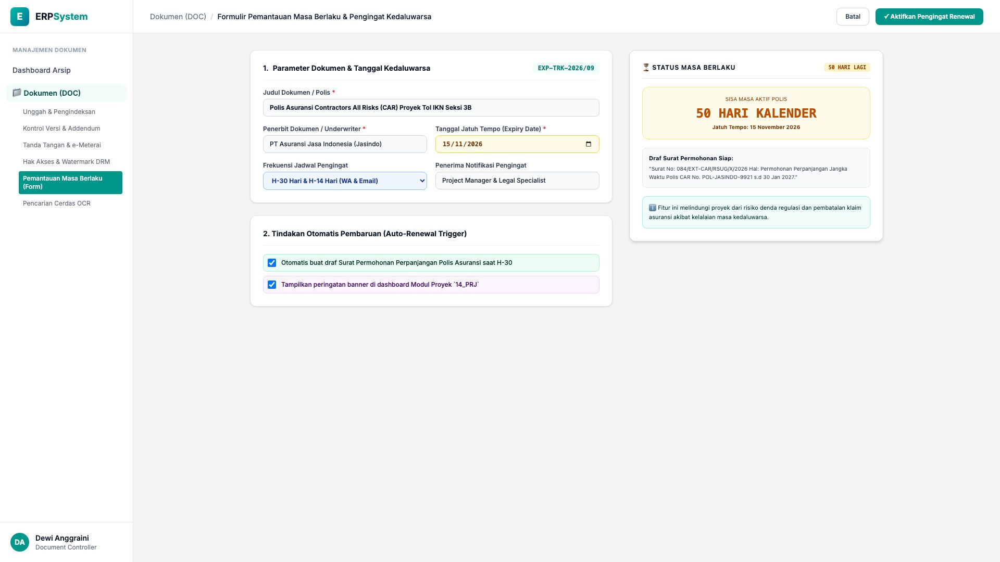
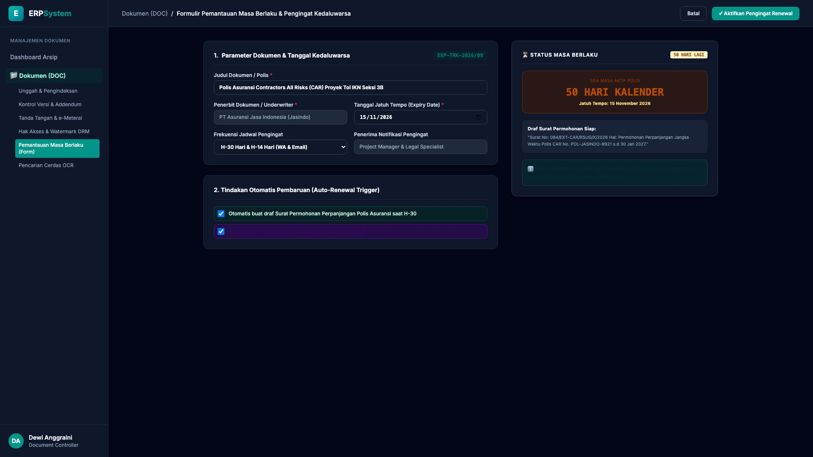

# 🎨 Design UI — Formulir Pemantauan Masa Berlaku & Kedaluwarsa Dokumen (Data Entry Screen)

> Mockup antarmuka **Formulir Pemantauan Masa Berlaku Dokumen & Polis Kontrak (Contract Expiry & Renewal Data Entry)**: desain *Split-Screen Form* dengan formulir pengaturan jatuh tempo di sebelah kiri (Nomor Pemantauan `EXP-TRK-2026/09`, judul Polis Asuransi CAR Proyek Tol IKN Seksi 3B dari PT Asuransi Jasindo, tanggal jatuh tempo 15 November 2026, frekuensi pengingat H-30 & H-14 via WA/Email ke PM & Legal, tindakan otomatis buat draf surat permohonan perpanjangan) dan *Live Kartu Countdown Masa Berlaku (Sisa 50 Hari Kalender & Draf Surat Permohonan Perpanjangan Resmi No. 084/EXT-CAR/RSUG/X/2026)* di sebelah kanan pada modul `DOC` (Manajemen Dokumen & Arsip Digital) dalam ERP System.

---

## Light Mode

---

## Dark Mode

---

## 📝 Komponen & Fitur Formulir Input

1. **Panel Kiri — Formulir Parameter Jatuh Tempo & Pengingat**:
   - Kode Pemantauan: `EXP-TRK-2026/09` &bull; Target: `Polis Asuransi CAR Proyek Tol IKN`.
   - Tanggal Kedaluwarsa: **15 November 2026**.
   - Jadwal Notifikasi: **H-30 Hari & H-14 Hari (WA Bot & Email)**.
   - Otomasi Pembaruan: *Generate Draf Surat Perpanjangan Polis Otomatis*.

2. **Panel Kanan — Kartu Countdown & Draf Surat Perpanjangan**:
   - Countdown Visual: **50 Hari Kalender Tersisa**.
   - Kesiapan Draf Surat Resmi ke Penerbit Asuransi Jasindo.
