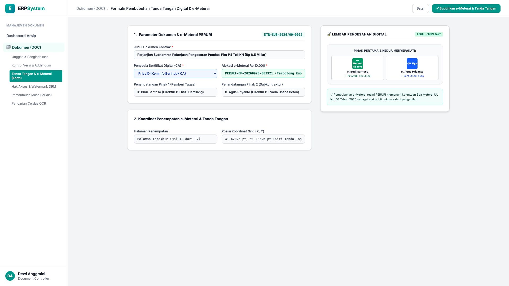
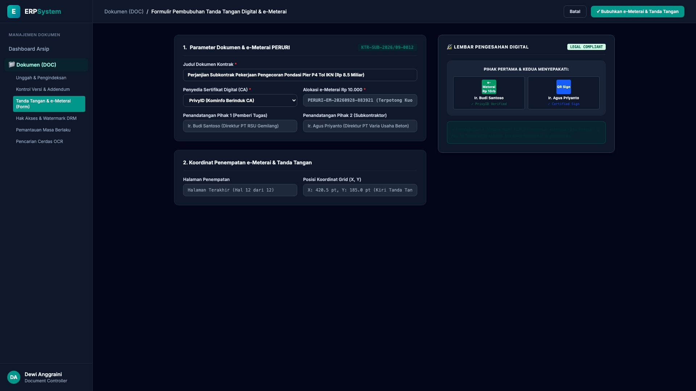

# 🎨 Design UI — Formulir Pembubuhan Tanda Tangan & e-Meterai (Data Entry Screen)

> Mockup antarmuka **Formulir Pembubuhan Tanda Tangan Digital & e-Meterai PERURI (Digital Signature & Certified e-Meterai Data Entry)**: desain *Split-Screen Form* dengan formulir koordinat penandatanganan di sebelah kiri (Nomor Dokumen `KTR-SUB-2026/09-0012` Kontrak Subkontraktor Tol IKN Rp 8.5 Miliar, CA Provider PrivyID Kominfo, alokasi e-Meterai PERURI Rp 10.000 serial `PERURI-EM-20260928-883921`, koordinat grid X: 420.5 pt Y: 185 pt Halaman 12, Pihak 1 Ir. Budi Santoso PT RSU Gemilang & Pihak 2 Ir. Agus Priyanto PT Varia Usaha Beton) dan *Live Pratinjau Lembar Pengesahan Digital (Dual Sign Box dengan Stempel e-Meterai PERURI & QR PrivyID Verified)* di sebelah kanan pada modul `DOC` (Manajemen Dokumen & Arsip Digital) dalam ERP System.

---

## Light Mode

---

## Dark Mode

---

## 📝 Komponen & Fitur Formulir Input

1. **Panel Kiri — Formulir Parameter e-Sign & e-Meterai**:
   - Kode Kontrak: `KTR-SUB-2026/09-0012` &bull; Nilai: **Rp 8.500.000.000**.
   - Penyedia Sertifikat: **PrivyID (Kominfo Berinduk CA)**.
   - e-Meterai Resmi: **PERURI Rp 10.000 (Serial: EM-883921)**.
   - Penempatan Koordinat: *Halaman 12 (X: 420.5 pt, Y: 185.0 pt)*.

2. **Panel Kanan — Lembar Pengesahan Digital Legal**:
   - Tampilan Blok Tanda Tangan Digital Ganda Pihak 1 & 2.
   - Legalitas Kepatuhan: *Sesuai UU Bea Meterai No. 10/2020 & UU ITE*.
