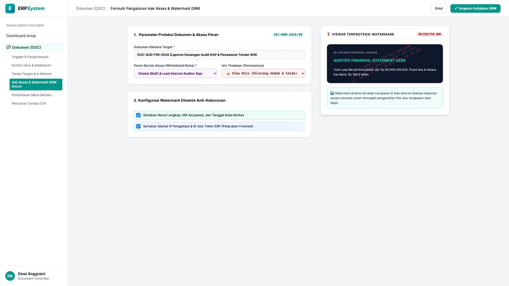
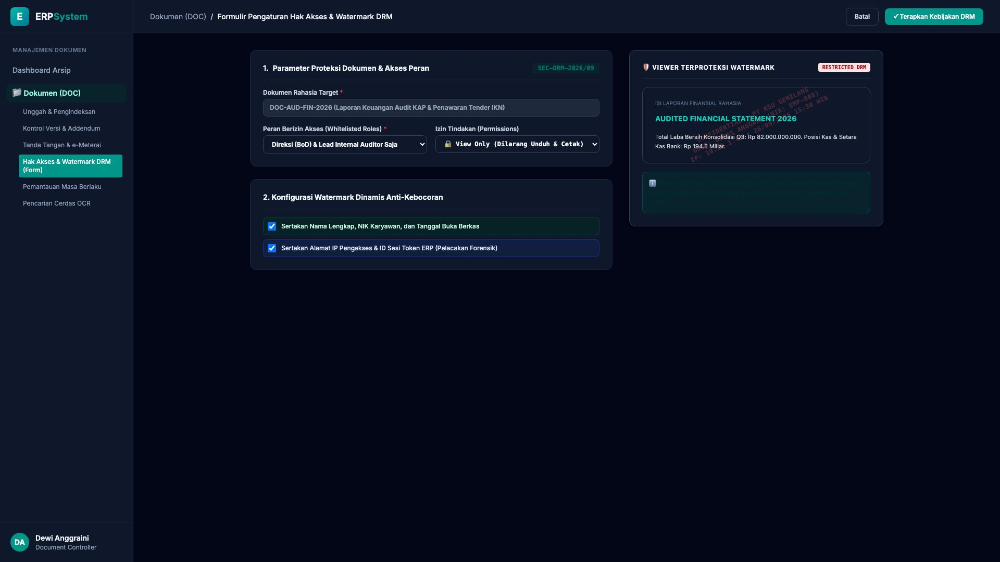

# 🎨 Design UI — Formulir Hak Akses & Watermark DRM (Data Entry Screen)

> Mockup antarmuka **Formulir Pengaturan Hak Akses Dokumen & Watermark DRM (Document Access Permissions & Digital Rights Management Data Entry)**: desain *Split-Screen Form* dengan formulir kebijakan akses di sebelah kiri (Nomor Kebijakan `SEC-DRM-2026/09`, dokumen rahasia `DOC-AUD-FIN-2026` Laporan Keuangan Audit KAP & Penawaran Tender IKN, peran berizin Direksi BoD & Lead Internal Audit saja, izin View Only dilarang unduh/cetak, konfigurasi watermark dinamis: NIK, nama lengkap, tanggal, alamat IP & sesi token ERP) dan *Live Pratinjau Viewer Dokumen dengan Overlay Watermark Transparan Anti-Kebocoran (Pelacakan Forensik)* di sebelah kanan pada modul `DOC` (Manajemen Dokumen & Arsip Digital) dalam ERP System.

---

## Light Mode

---

## Dark Mode

---

## 📝 Komponen & Fitur Formulir Input

1. **Panel Kiri — Formulir Hak Akses Peran & Kebijakan DRM**:
   - Kode Kebijakan: `SEC-DRM-2026/09` &bull; Target: `Laporan Keuangan Audit KAP`.
   - Whitelist Peran: **Direksi (BoD) & Lead Auditor Internal**.
   - Hak Akses: **🔒 View Only (Restricted Mode - Anti-Download & Anti-Print)**.
   - Dynamic Watermark: *Nama, NIK Karyawan, Alamat IP & Timestamp*.

2. **Panel Kanan — Viewer Terproteksi Watermark Transparan**:
   - Tampilan Overlay Diagonal Anti-Foto (*Property of PT RSUG - User NIK/IP Tracked*).
   - Pencegahan Kebocoran Dokumen Sensitif Perusahaan ke Pihak Luar.
