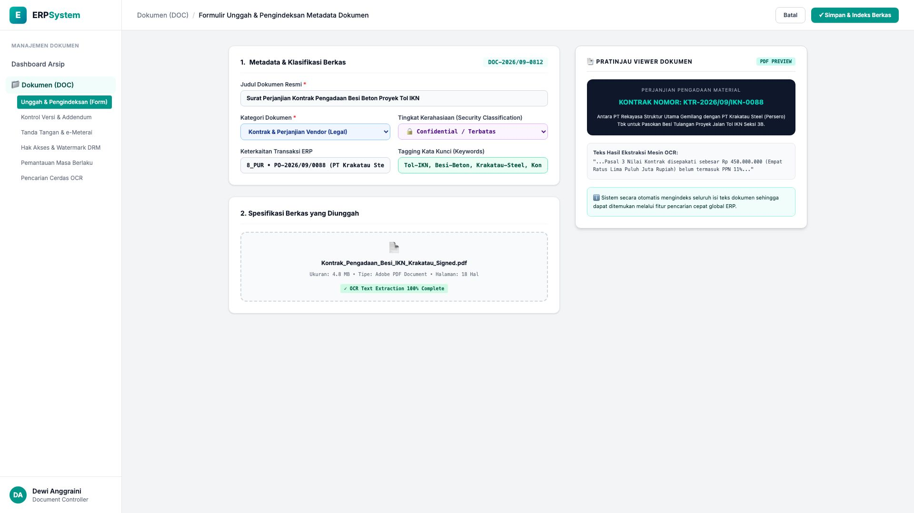
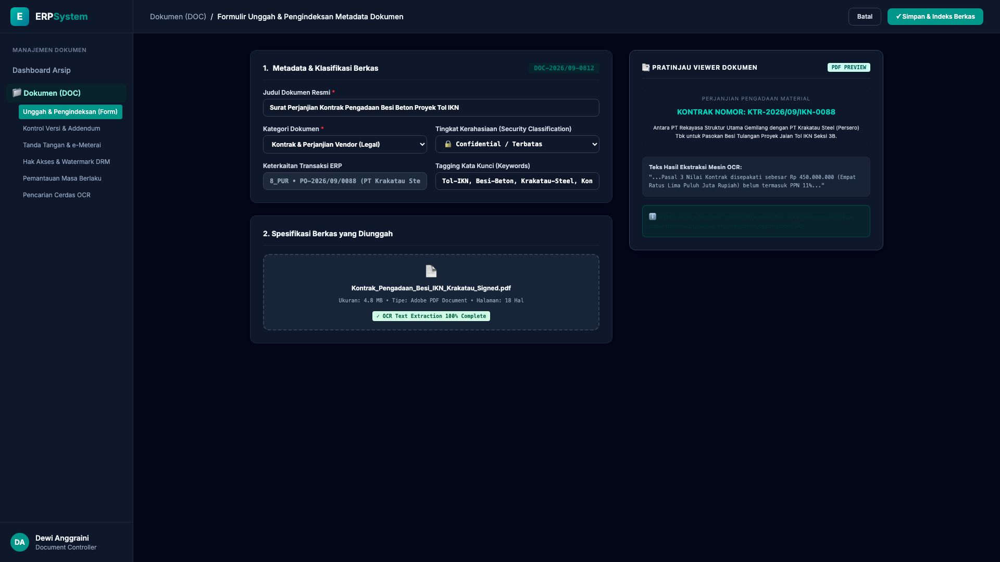

# 🎨 Design UI — Formulir Unggah & Pengindeksan Metadata Dokumen (Data Entry Screen)

> Mockup antarmuka **Formulir Unggah & Pengindeksan Metadata Dokumen (Document Upload & Metadata Tagging Data Entry)**: desain *Split-Screen Form* dengan formulir klasifikasi berkas di sebelah kiri (Nomor Arsip `DOC-2026/09-0812`, judul Surat Perjanjian Kontrak Pengadaan Besi Beton Proyek Tol IKN, kategori Kontrak & Perjanjian Legal, tingkat kerahasiaan Confidential, relasi transaksi `PO-2026/09/0088` Krakatau Steel, tagging `Tol-IKN, Besi-Beton, Krakatau-Steel`, berkas PDF 4.8 MB 18 hal dengan ekstraksi teks OCR 100%) dan *Live Pratinjau Viewer Dokumen PDF & Cuplikan Teks Hasil Ekstraksi OCR Cerdas* di sebelah kanan pada modul `DOC` (Manajemen Dokumen & Arsip Digital) dalam ERP System.

---

## Light Mode

---

## Dark Mode

---

## 📝 Komponen & Fitur Formulir Input

1. **Panel Kiri — Formulir Parameter Metadata & Tagging**:
   - Kode Arsip: `DOC-2026/09-0812` &bull; Kategori: `Kontrak & Perjanjian Legal`.
   - Tingkat Keamanan: **🔒 Confidential / Terbatas**.
   - Integrasi ERP: **Modul 8_PUR (PO-2026/09/0088 Krakatau Steel)**.
   - Tagging Kata Kunci: *Tol-IKN, Besi-Beton, Krakatau-Steel, Kontrak-2026*.

2. **Panel Kanan — Viewer Dokumen PDF & Ekstraksi OCR**:
   - Tampilan Header Kontrak (*KTR-2026/09/IKN-0088*).
   - Ekstraksi Otomatis Teks OCR ke Mesin Pencarian Full-Text Search.
