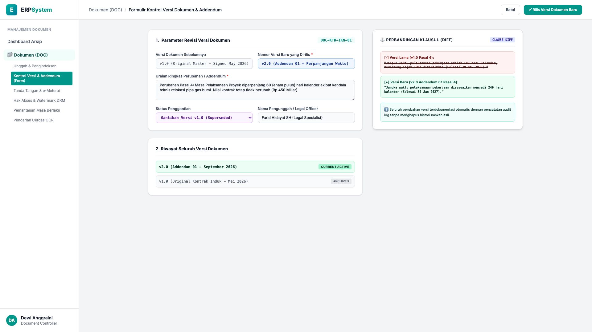
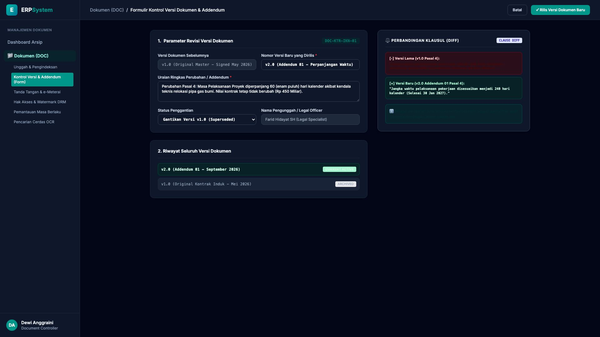

# 🎨 Design UI — Formulir Kontrol Versi Dokumen & Addendum (Data Entry Screen)

> Mockup antarmuka **Formulir Kontrol Revisi & Versioning Berkas (Document Version Control & Addendum Data Entry)**: desain *Split-Screen Form* dengan formulir pendaftaran revisi versi di sebelah kiri (Nomor Induk `DOC-KTR-IKN-01`, versi lama `v1.0 (Original Master Mei 2026)` &rarr; versi baru `v2.0 (Addendum 01 - Perpanjangan Waktu)`, uraian revisi: perpanjangan waktu pelaksanaan 60 hari kalender pada Pasal 4 akibat relokasi pipa gas tanpa penambahan nilai kontrak Rp 450 Miliar, pengunggah Legal Specialist) dan *Live Pratinjau Perbandingan Klausul Side-by-Side Diff (v1.0 180 Hari Selesai Nov 2026 vs v2.0 240 Hari Selesai Jan 2027)* di sebelah kanan pada modul `DOC` (Manajemen Dokumen & Arsip Digital) dalam ERP System.

---

## Light Mode

---

## Dark Mode

---

## 📝 Komponen & Fitur Formulir Input

1. **Panel Kiri — Formulir Revisi Versi & Uraian Addendum**:
   - Kode Dokumen: `DOC-KTR-IKN-01`.
   - Versi Rilis Baru: **v2.0 (Addendum 01 - Perpanjangan Waktu)**.
   - Status Penggantian: *Supersedes v1.0 (Arsip Master Historis Tetap Terjaga)*.
   - Legal Officer: *Farid Hidayat SH (Legal Specialist)*.

2. **Panel Kanan — Perbandingan Klausul Side-by-Side Diff**:
   - Highlight Visual Perubahan Kalimat pada Pasal 4.
   - Pelacakan Penyesuaian Tanggal Serah Terima Proyek (*30 Nov 2026 &rarr; 30 Jan 2027*).
