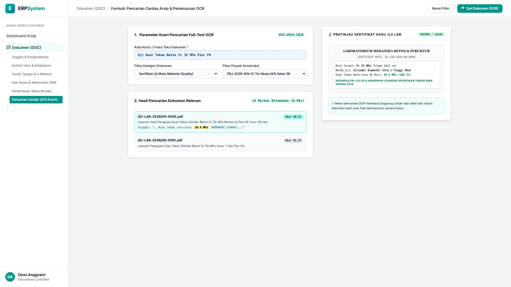
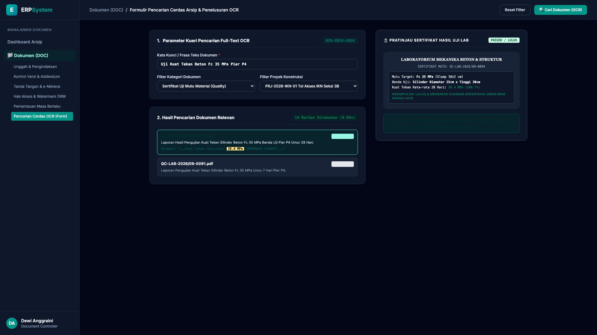

# 🎨 Design UI — Formulir Pencarian Cerdas Arsip & Penelusuran OCR (Data Entry Screen)

> Mockup antarmuka **Formulir Pencarian Cerdas Arsip & Penelusuran OCR (OCR Full-Text Search Explorer Data Entry)**: desain *Split-Screen Form* dengan formulir parameter pencarian di sebelah kiri (Nomor Kueri `OCR-SRCH-2026`, kata kunci `"Uji Kuat Tekan Beton Fc 35 MPa Pier P4"`, filter kategori Sertifikat Mutu QC Proyek Tol IKN Seksi 3B, 14 berkas ditemukan dalam 0.08 detik, hasil teratas `QC-LAB-2026/09-0094.pdf` skor 98.5% snippet *"...Kuat tekan rata-rata: 38.4 MPa (MEMENUHI SYARAT)..."*) dan *Live Pratinjau Sertifikat Fisik Hasil Uji Laboratorium dengan Highlight Kelulusan Mutu (Kuat Tekan 28 Hari 38.4 MPa / 109.7% Lulus Standar Bina Marga 2018)* di sebelah kanan pada modul `DOC` (Manajemen Dokumen & Arsip Digital) dalam ERP System.

---

## Light Mode

---

## Dark Mode

---

## 📝 Komponen & Fitur Formulir Input

1. **Panel Kiri — Formulir Parameter Pencarian OCR & Hasil Relevan**:
   - Kata Kunci: `"Uji Kuat Tekan Beton Fc 35 MPa Pier P4"`.
   - Filter Kategori: `Sertifikat Uji Mutu Material (QC)`.
   - Kecepatan Indeks: *14 Berkas Ditemukan dalam 0.08 detik*.
   - Dokumen Match Teratas: `QC-LAB-2026/09-0094.pdf` (Skor Relevansi 98.5%).

2. **Panel Kanan — Viewer Sertifikat Lab & Highlight Kelulusan Mutu**:
   - Tampilan Sertifikat Fisik Hasil Uji Laboratorium Mekanika Beton.
   - Hasil Uji Kuat Tekan 28 Hari: **38.4 MPa (Status LULUS Spek Teknis)**.
