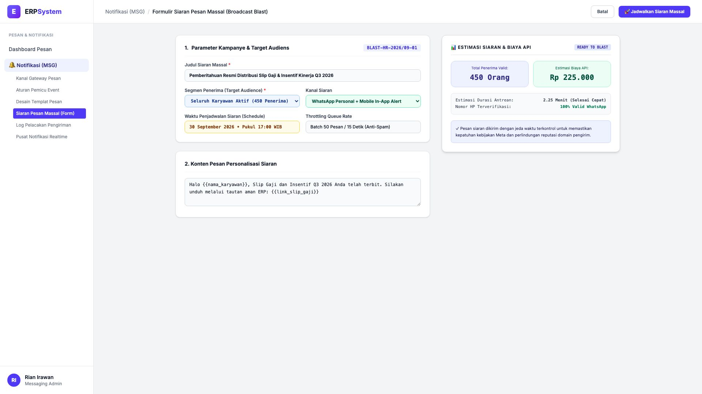
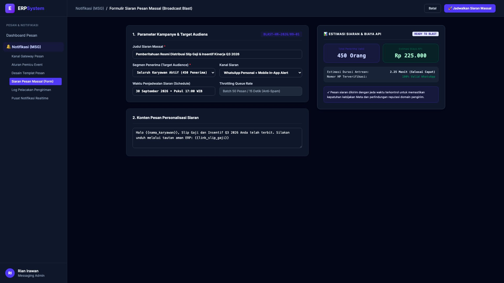

# 🎨 Design UI — Formulir Siaran Pesan Massal (Data Entry Screen)

> Mockup antarmuka **Formulir Siaran Pesan Massal & Kampanye Broadcast (Broadcast Blast Campaign Data Entry)**: desain *Split-Screen Form* dengan formulir pengaturan kampanye siaran di sebelah kiri (Nomor Kampanye `BLAST-HR-2026/09-01`, judul Pemberitahuan Resmi Distribusi Slip Gaji & Insentif Kinerja Q3 2026, segmen penerima seluruh 450 karyawan aktif, kanal WhatsApp Personal + Mobile In-App, jadwal 30 September 2026 17:00 WIB, throttling rate 50 pesan/15 detik anti-spam, pesan personalisasi dengan variabel slip gaji) dan *Live Pratinjau Estimasi Distribusi Pesan (450 Karyawan 100% Nomor Valid) & Estimasi Biaya Kuota API Meta (Rp 225.000 / 2.25 Menit Selesai)* di sebelah kanan pada modul `MSG` (Pesan & Notifikasi Gateway) dalam ERP System.

---

## Light Mode

---

## Dark Mode

---

## 📝 Komponen & Fitur Formulir Input

1. **Panel Kiri — Formulir Parameter Broadcast Massal**:
   - Kode Kampanye: `BLAST-HR-2026/09-01`.
   - Target Audiens: **Seluruh Karyawan Aktif (450 Orang)**.
   - Kanal Pengiriman: **WhatsApp Personal & Mobile In-App Alert**.
   - Waktu Eksekusi: **30 September 2026 Pukul 17:00 WIB**.
   - Anti-Spam Queue: *Batch 50 Pesan / 15 Detik*.

2. **Panel Kanan — Ringkasan Audiens & Estimasi Biaya**:
   - Total Penerima Terverifikasi: **450 Nomor HP Valid WhatsApp**.
   - Estimasi Biaya Pemakaian API: **Rp 225.000**.
   - Durasi Pengiriman Antrean: *2.25 Menit (Cepat & Aman)*.
