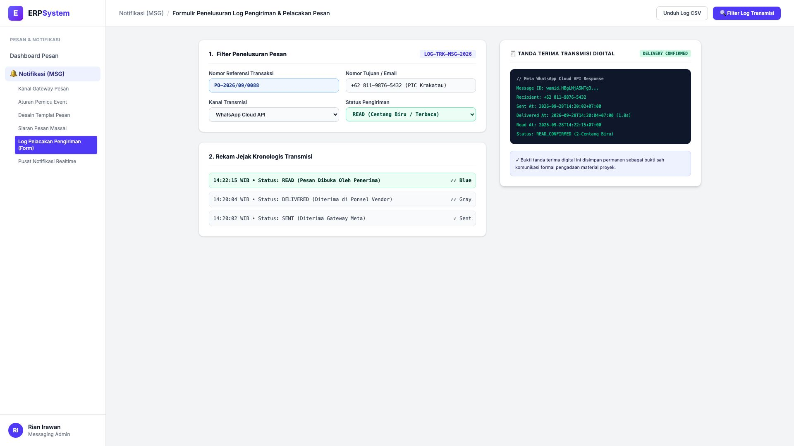
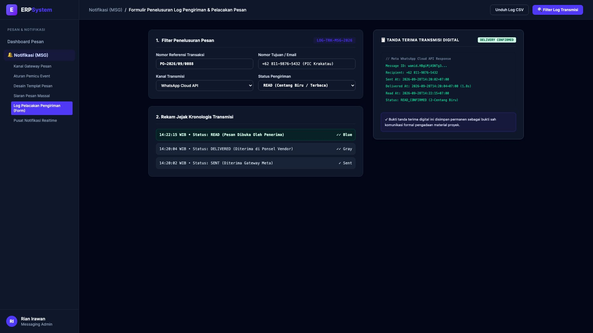

# 🎨 Design UI — Formulir Penelusuran Log Pengiriman Pesan (Data Entry Screen)

> Mockup antarmuka **Formulir Penelusuran Log Pengiriman & Pelacakan Pesan (Message Delivery Log & Audit Tracker Data Entry)**: desain *Split-Screen Form* dengan formulir pencarian log transmisi di sebelah kiri (Nomor Pelacakan `LOG-TRK-MSG-2026`, filter transaksi `PO-2026/09/0088`, nomor penerima `+62 811-9876-5432` PT Krakatau Steel, status pengiriman READ Centang Biru, riwayat kronologis: 14:20:02 Dikirim ke Gateway Meta &rarr; 14:20:04 Diterima di Ponsel Vendor 2-Centang Abu &rarr; 14:22:15 Dibaca oleh Penerima 2-Centang Biru) dan *Live Rincian Status Transmisi Gateway & Bukti Tanda Terima Digital Resmi (Meta Message ID `wamid.HBgLM...`, Delivery Duration 1.8s & Status READ_CONFIRMED)* di sebelah kanan pada modul `MSG` (Pesan & Notifikasi Gateway) dalam ERP System.

---

## Light Mode

---

## Dark Mode

---

## 📝 Komponen & Fitur Formulir Input

1. **Panel Kiri — Formulir Parameter Filter & Kronologis Transmisi**:
   - Kode Pelacakan: `LOG-TRK-MSG-2026`.
   - Dokumen Sumber: **PO-2026/09/0088**.
   - Tujuan: **+62 811-9876-5432 (PIC Krakatau Steel)**.
   - Status Transmisi: **READ (2-Centang Biru Terbaca)**.
   - Jejak Waktu: *Sent 14:20:02 &bull; Delivered 14:20:04 &bull; Read 14:22:15 WIB*.

2. **Panel Kanan — Bukti Tanda Terima Digital Resmi Meta**:
   - ID Pesan Unik: `wamid.HBgLMjA5NTg3...`.
   - Waktu Latensi Pengiriman: **1.8 Detik**.
   - Bukti Validitas: *Arsip Bukti Komunikasi Formal Pengadaan*.
