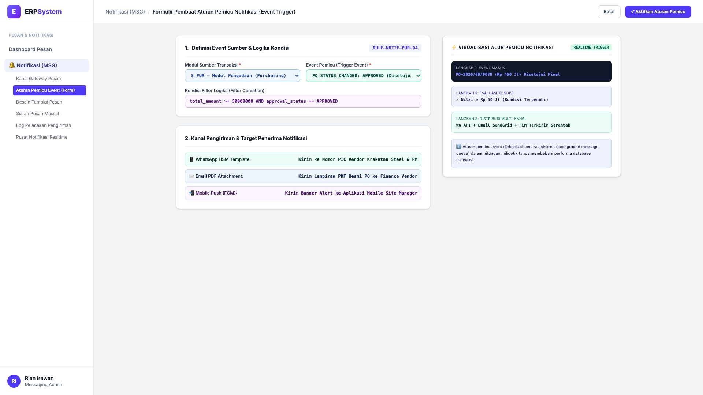
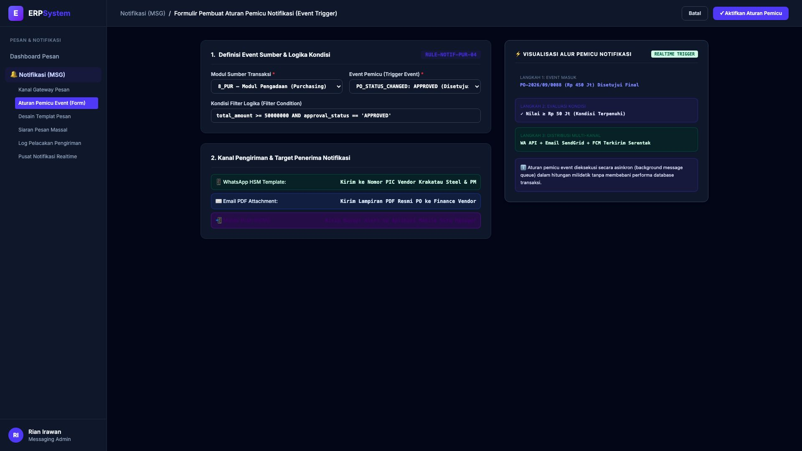

# 🎨 Design UI — Formulir Pembuat Aturan Pemicu Notifikasi (Data Entry Screen)

> Mockup antarmuka **Formulir Pembuat Aturan Pemicu Notifikasi (Event-Based Notification Trigger Data Entry)**: desain *Split-Screen Form* dengan formulir logika kondisi pemicu di sebelah kiri (Nomor Aturan `RULE-NOTIF-PUR-04`, modul sumber `8_PUR`, event pemicu `PO_STATUS_CHANGED: APPROVED`, kondisi `total_amount >= 50000000 AND approval_status == 'APPROVED'`, distribusi 3 kanal: WhatsApp HSM ke Vendor/PM + Email PDF Attachment ke Finance Vendor + Mobile Push FCM ke Site Manager) dan *Live Visualisasi Alur Node Pemicu Notifikasi Realtime (Langkah 1 Event Masuk &rarr; Langkah 2 Evaluasi Logika &rarr; Langkah 3 Distribusi Multi-Kanal Otomatis)* di sebelah kanan pada modul `MSG` (Pesan & Notifikasi Gateway) dalam ERP System.

---

## Light Mode

---

## Dark Mode

---

## 📝 Komponen & Fitur Formulir Input

1. **Panel Kiri — Formulir Definisi Event & Kanal Pengiriman**:
   - Kode Aturan: `RULE-NOTIF-PUR-04`.
   - Modul Sumber: **8_PUR (Purchasing Engine)**.
   - Pemicu: **PO Status Changed to APPROVED**.
   - Formula Logika: `total_amount >= 50000000 AND approval_status == 'APPROVED'`.
   - 3 Target Distribusi Serentak: WhatsApp Bot, Email PDF & Push Mobile.

2. **Panel Kanan — Visualisasi Alur Pemicu Notifikasi**:
   - Skema Waktu Nyata dari Event Transaksi Masuk hingga Eksekusi Queue.
   - Peringatan Otomatis Tanpa Membebani Latensi Transaksi Utama.
