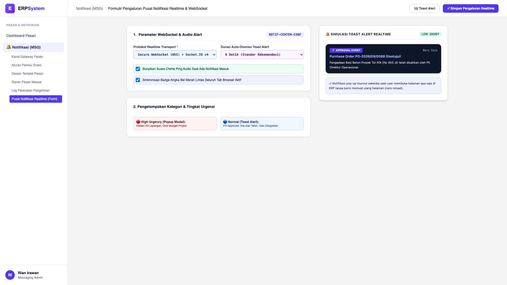
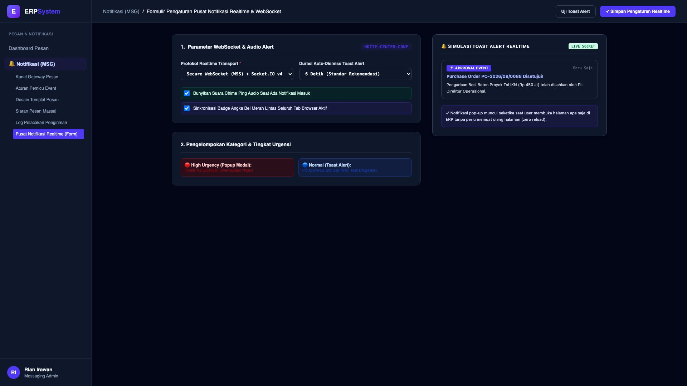

# 🎨 Design UI — Formulir Pusat Notifikasi Realtime & WebSocket (Data Entry Screen)

> Mockup antarmuka **Formulir Pengaturan Pusat Notifikasi Realtime & WebSocket (Realtime In-App Push Center Data Entry)**: desain *Split-Screen Form* dengan formulir konfigurasi transport WebSocket di sebelah kiri (Nomor Konfigurasi `NOTIF-CENTER-CONF`, protokol WSS Socket.IO v4, durasi auto-dismiss toast alert 6 detik, audio alert suara Chime Ping aktif, sinkronisasi unread badge counter lintas tab browser, klasifikasi tingkat urgensi normal vs darurat K3) dan *Live Pratinjau Interaktif Pop-up Toast Alert Realtime ("⚡ APPROVAL EVENT: PO-2026/09/0088 Pengadaan Besi Beton Rp 450 Jt Disahkan Plt Dir Ops") & In-App Notification Drawer* di sebelah kanan pada modul `MSG` (Pesan & Notifikasi Gateway) dalam ERP System.

---

## Light Mode

---

## Dark Mode

---

## 📝 Komponen & Fitur Formulir Input

1. **Panel Kiri — Formulir Parameter Transport & Audio**:
   - Kode Konfigurasi: `NOTIF-CENTER-CONF`.
   - Transport Protocol: **Secure WebSocket (WSS) + Socket.IO v4**.
   - Alert Behavior: *Auto-Dismiss 6 Detik & Audio Chime Ping*.
   - Tab Sync: *Sinkronisasi Unread Badge Lintas Seluruh Tab Aktif*.

2. **Panel Kanan — Simulasi Pop-up Toast Alert Realtime**:
   - Tampilan Pop-up Toast Notifikasi Instan di Sudut Kanan Layar.
   - Peringatan Transaksi Tanpa Perlu Reload Halaman (Zero Reload).
