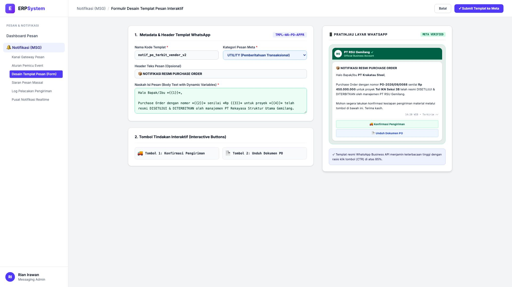
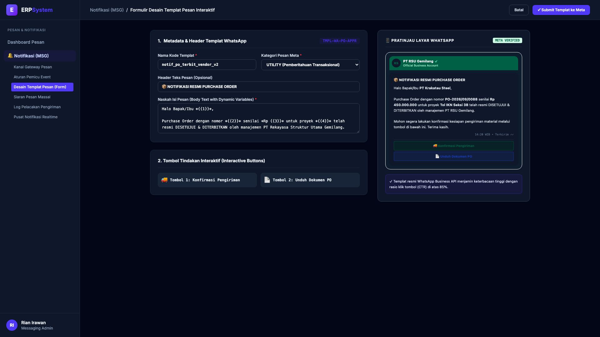

# 🎨 Design UI — Formulir Desain Templat Pesan Interaktif (Data Entry Screen)

> Mockup antarmuka **Formulir Desain Templat Pesan Interaktif (Interactive Message Template Builder Data Entry)**: desain *Split-Screen Form* dengan formulir perancangan pesan di sebelah kiri (Kode Templat `TMPL-WA-PO-APPR`, nama terdaftar `notif_po_terbit_vendor_v2`, kategori UTILITY Meta, variabel dinamis `{{1}}` Nama Vendor, `{{2}}` No PO, `{{3}}` Nilai Rp 450 Jt, `{{4}}` Proyek Tol IKN, 2 tombol tindakan interaktif cepat Quick Reply: "🚚 Konfirmasi Pengiriman" & "📄 Unduh Dokumen PO") dan *Live Pratinjau Tampilan Percakapan Layar Ponsel WhatsApp Resmi Bercentang Hijau (Official Business Account PT RSU Gemilang)* di sebelah kanan pada modul `MSG` (Pesan & Notifikasi Gateway) dalam ERP System.

---

## Light Mode

---

## Dark Mode

---

## 📝 Komponen & Fitur Formulir Input

1. **Panel Kiri — Formulir Metadata & Variabel Templat**:
   - Kode Templat: `TMPL-WA-PO-APPR`.
   - Kategori Meta: **UTILITY (Pemberitahuan Transaksional)**.
   - Variabel Parameter: *Nama Vendor, Nomor PO, Total Nilai & Nama Proyek*.
   - Tombol Interaktif: *Konfirmasi Jadwal Kirim & Unduh Dokumen PO Digital*.

2. **Panel Kanan — Simulasi Layar WhatsApp Bisnis Resmi**:
   - Tampilan Balon Pesan WhatsApp Terverifikasi Centang Hijau.
   - Konfirmasi Cepat Melalui Tombol Call-to-Action (CTA).
