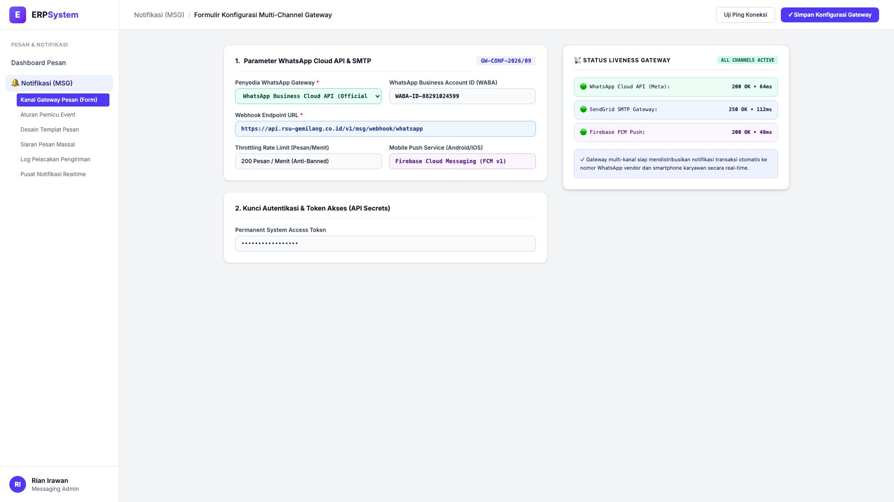
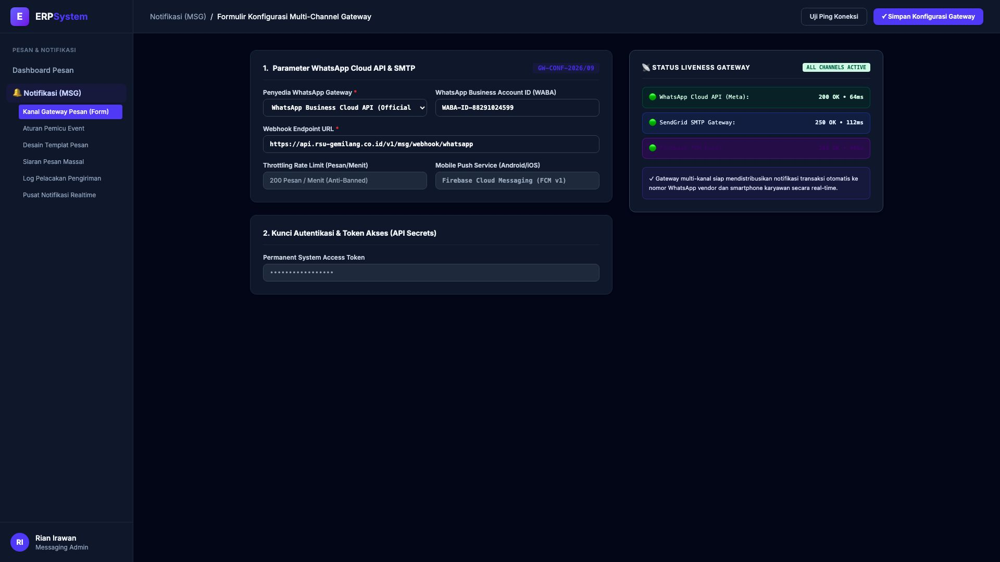

# 🎨 Design UI — Formulir Konfigurasi Multi-Channel Gateway (Data Entry Screen)

> Mockup antarmuka **Formulir Konfigurasi Kanal Gateway Pesan & Notifikasi (Multi-Channel Gateway Config Data Entry)**: desain *Split-Screen Form* dengan formulir pengaturan konektivitas di sebelah kiri (Nomor Konfigurasi `GW-CONF-2026/09`, WhatsApp Cloud API Official Meta WABA `WABA-ID-88291024599`, Webhook Endpoint URL, Throttling Rate 200 pesan/menit, Firebase Cloud Messaging FCM v1 untuk Push Notification Mobile Android/iOS, API Secrets Token) dan *Live Simulator Status Liveness & Uji Ping Response Gateway (WhatsApp 200 OK 64ms, SendGrid SMTP 250 OK 112ms, Firebase FCM 200 OK 48ms)* di sebelah kanan pada modul `MSG` (Pesan & Notifikasi Gateway) dalam ERP System.

---

## Light Mode

---

## Dark Mode

---

## 📝 Komponen & Fitur Formulir Input

1. **Panel Kiri — Formulir Parameter Gateway Multi-Kanal**:
   - Kode Gateway: `GW-CONF-2026/09`.
   - Penyedia WhatsApp: **Official Meta WhatsApp Cloud API**.
   - Mobile Push: **Firebase Cloud Messaging (FCM v1)**.
   - Throttling Protection: *Maksimal 200 Pesan per Menit (Anti-Spam)*.

2. **Panel Kanan — Simulator Liveness & Waktu Respon Ping**:
   - Status Koneksi WhatsApp API: **200 OK (Latency: 64ms)**.
   - Status Email SendGrid: **250 OK (Latency: 112ms)**.
   - Status FCM Mobile Push: **200 OK (Latency: 48ms)**.
