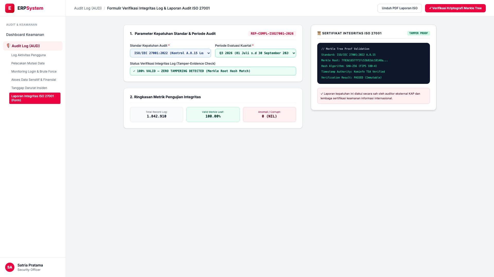
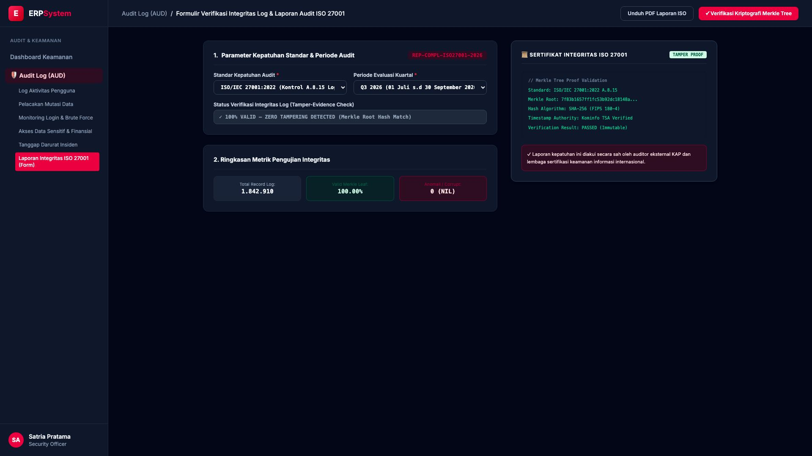

# 🎨 Design UI — Formulir Laporan Integritas Log & ISO 27001 (Data Entry Screen)

> Mockup antarmuka **Formulir Verifikasi Integritas Log & Laporan Audit Kepatuhan ISO 27001 (Compliance Integrity & ISO 27001 Audit Report Data Entry)**: desain *Split-Screen Form* dengan formulir parameter audit di sebelah kiri (Nomor Laporan `REP-COMPL-ISO27001-2026`, standar kepatuhan ISO/IEC 27001:2022 Kontrol A.8.15 Logging & UU ITE No. 1/2024, periode evaluasi Q3 2026, status verifikasi 100% VALID ZERO TAMPERING DETECTED, total 1.842.910 rekaman log terverifikasi tanpa anomali) dan *Live Pratinjau Sertifikat Integritas Kriptografi Merkle Tree Log Audit (Merkle Root Hash `7f83b165...`, SHA-256 FIPS 180-4, Kominfo TSA Verified & Immutable)* di sebelah kanan pada modul `AUD` (Audit Trail & Log Keamanan) dalam ERP System.

---

## Light Mode

---

## Dark Mode

---

## 📝 Komponen & Fitur Formulir Input

1. **Panel Kiri — Formulir Parameter Audit & Metrik Pengujian**:
   - Kode Laporan: `REP-COMPL-ISO27001-2026`.
   - Standar Regulasi: **ISO/IEC 27001:2022 Kontrol A.8.15 & UU ITE**.
   - Periode Evaluasi: **Q3 2026 (01 Juli s.d 30 September 2026)**.
   - Total Rekaman Log: **1.842.910 Log Entries (100% Valid Merkle Leaf)**.

2. **Panel Kanan — Sertifikat Kriptografi Integritas Merkle Tree**:
   - Hash Merkle Root: `7f83b1657ff1fc53b92dc18148a...`.
   - Otoritas Waktu: **Kominfo Timestamp Authority (TSA) Verified**.
   - Jaminan Legalitas: *Bukti Sah dan Anti-Manipulasi (Tamper-Proof) untuk KAP*.
