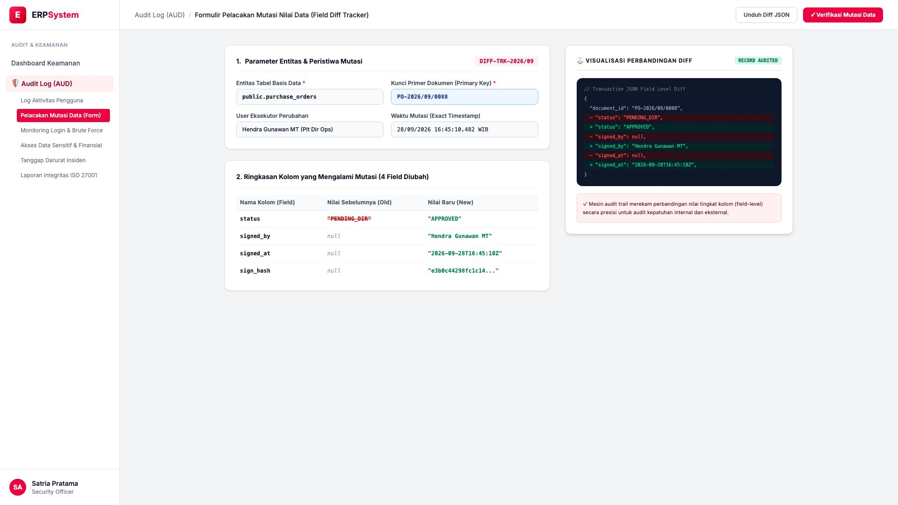
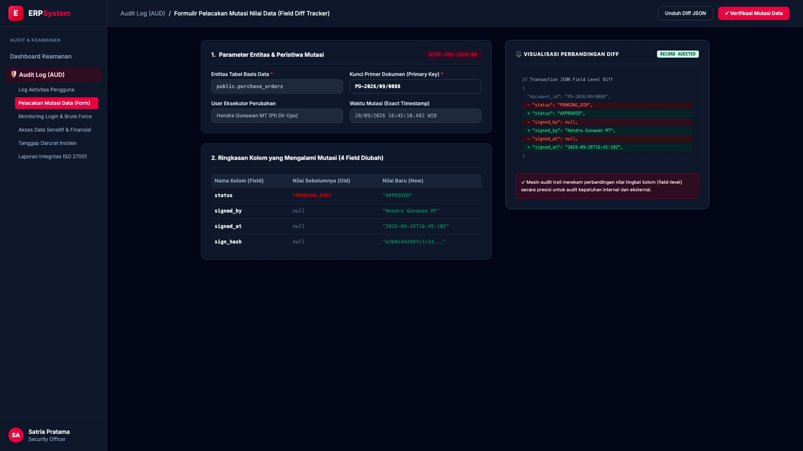

# 🎨 Design UI — Formulir Pelacakan Mutasi Nilai Data (Data Entry Screen)

> Mockup antarmuka **Formulir Pelacakan Mutasi Nilai Data (Data Mutation Field Diff Tracker Data Entry)**: desain *Split-Screen Form* dengan formulir parameter mutasi entitas di sebelah kiri (Nomor Pelacakan `DIFF-TRK-2026/09`, tabel `public.purchase_orders`, primary key `PO-2026/09/0088`, eksekutor Hendra Gunawan MT Plt Dir Ops, waktu mutasi 28/09/2026 16:45:10.482 WIB, ringkasan 4 kolom dimutasi: status, signed_by, signed_at, sign_hash) dan *Live Visualisasi Perbandingan Nilai Sebelum vs Sesudah (Before vs After JSON Field Diff with Red/Green Highlights)* di sebelah kanan pada modul `AUD` (Audit Trail & Log Keamanan) dalam ERP System.

---

## Light Mode

---

## Dark Mode

---

## 📝 Komponen & Fitur Formulir Input

1. **Panel Kiri — Formulir Entitas Basis Data & Kolom Mutasi**:
   - Kode Pelacakan: `DIFF-TRK-2026/09`.
   - Entitas Target: `public.purchase_orders` (`PO-2026/09/0088`).
   - Eksekutor: **Hendra Gunawan MT (Plt Direktur Operasional)**.
   - 4 Kolom yang Bermutasi:
     - `status`: *"PENDING_DIR"* &rarr; **"APPROVED"**
     - `signed_by`: *null* &rarr; **"Hendra Gunawan MT"**
     - `signed_at`: *null* &rarr; **"2026-09-28T16:45:10Z"**
     - `sign_hash`: *null* &rarr; **"e3b0c44298fc1c14..."**.

2. **Panel Kanan — Visualisasi JSON Field Level Diff**:
   - Perbandingan Blok Kode JSON dengan Highlight Merah (Old) & Hijau (New).
   - Bukti Kepatuhan Audit Kualitas Data Transaksi Finansial.
