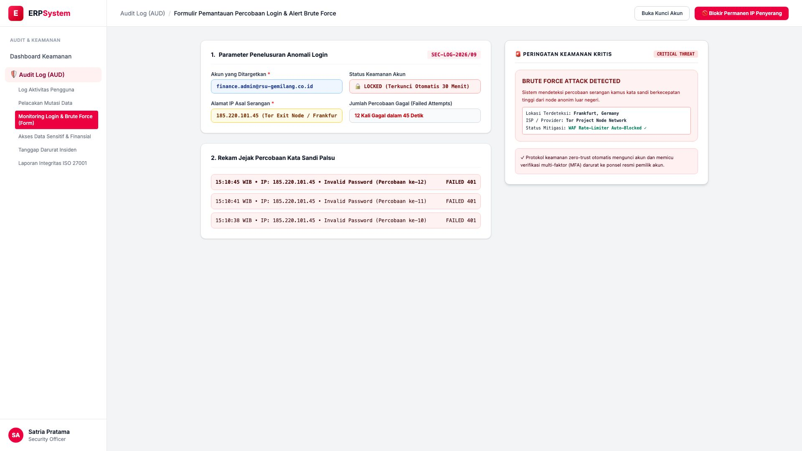
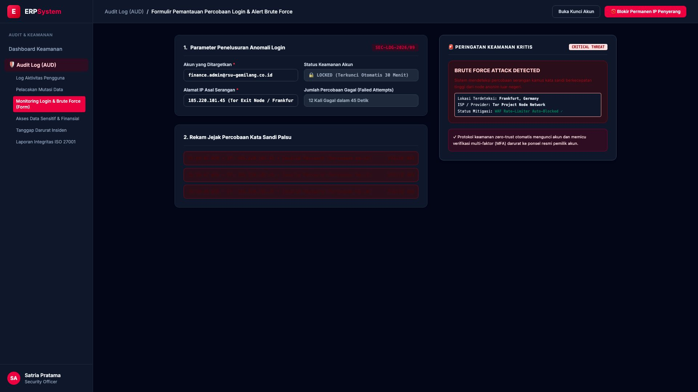

# 🎨 Design UI — Formulir Monitoring Login & Brute Force (Data Entry Screen)

> Mockup antarmuka **Formulir Pemantauan Percobaan Login & Alert Brute Force (Login Security & Threat Monitor Data Entry)**: desain *Split-Screen Form* dengan formulir parameter penelusuran anomali di sebelah kiri (Nomor Insiden `SEC-LOG-2026/09`, akun target `finance.admin@rsu-gemilang.co.id`, status akun 🔒 LOCKED terkunci 30 menit, IP asal serangan `185.220.101.45` Tor Exit Node Frankfurt DE, 12 kali gagal dalam 45 detik, riwayat kegagalan HTTP 401) dan *Live Kartu Peringatan Keamanan Merah Kritis (BRUTE FORCE ATTACK DETECTED & WAF Rate-Limiter Auto-Blocked)* di sebelah kanan pada modul `AUD` (Audit Trail & Log Keamanan) dalam ERP System.

---

## Light Mode

---

## Dark Mode

---

## 📝 Komponen & Fitur Formulir Input

1. **Panel Kiri — Formulir Parameter Penelusuran Serangan**:
   - Kode Insiden: `SEC-LOG-2026/09`.
   - Akun Target: `finance.admin@rsu-gemilang.co.id`.
   - Asal IP Penyerang: `185.220.101.45` (Tor Exit Node / Frankfurt DE).
   - Tindakan Otomatis: **Auto-Lock Akun 30 Menit & Notifikasi Darurat**.

2. **Panel Kanan — Kartu Peringatan Ancaman Kritis (SIEM)**:
   - Deteksi Serangan Kamus Kata Sandi (Password Dictionary Attack).
   - Status Mitigasi: **WAF Rate-Limiter Auto-Blocked (Zero Intrusion)**.
