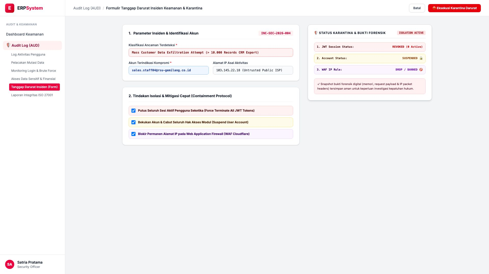
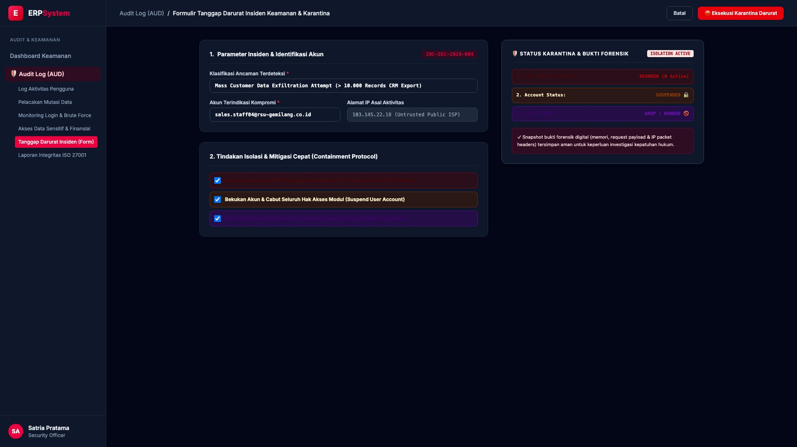

# 🎨 Design UI — Formulir Tanggap Darurat Insiden Keamanan (Data Entry Screen)

> Mockup antarmuka **Formulir Tanggap Darurat Insiden Keamanan & Tindakan Karantina (Security Incident Response & Containment Data Entry)**: desain *Split-Screen Form* dengan formulir eksekusi isolasi ancaman di sebelah kiri (Nomor Tiket Insiden `INC-SEC-2026-004`, klasifikasi ancaman mass customer data exfiltration attempt > 10.000 records CRM, akun terkompromi `sales.staff04@rsu-gemilang.co.id`, IP asal `103.145.22.18`, 3 tindakan isolasi seketika: force terminate JWT sessions, suspend user account, dan block IP di Cloudflare WAF) dan *Live Status Karantina Sistem & Bukti Forensik Terkunci (Sessions Revoked 0 Active, Account Suspended & WAF IP Banned)* di sebelah kanan pada modul `AUD` (Audit Trail & Log Keamanan) dalam ERP System.

---

## Light Mode

---

## Dark Mode

---

## 📝 Komponen & Fitur Formulir Input

1. **Panel Kiri — Formulir Eksekusi Tanggap Insiden Keamanan**:
   - Kode Tiket: `INC-SEC-2026-004`.
   - Deteksi Ancaman: **Mass Data Exfiltration Attempt (> 10.000 CRM Records)**.
   - Akun Terkompromi: `sales.staff04@rsu-gemilang.co.id`.
   - 3 Protokol Karantina:
     - 1. **Force Terminate Active JWT Sessions**
     - 2. **Suspend User Account & Revoke Roles**
     - 3. **Block IP on Cloudflare / WAF Firewall**.

2. **Panel Kanan — Status Isolasi & Bukti Forensik Digital**:
   - Status Karantina: **ISOLATION ACTIVE (0 Sesi Aktif)**.
   - Integritas Forensik: *Snapshot Memori & Header Paket Tersimpan*.
