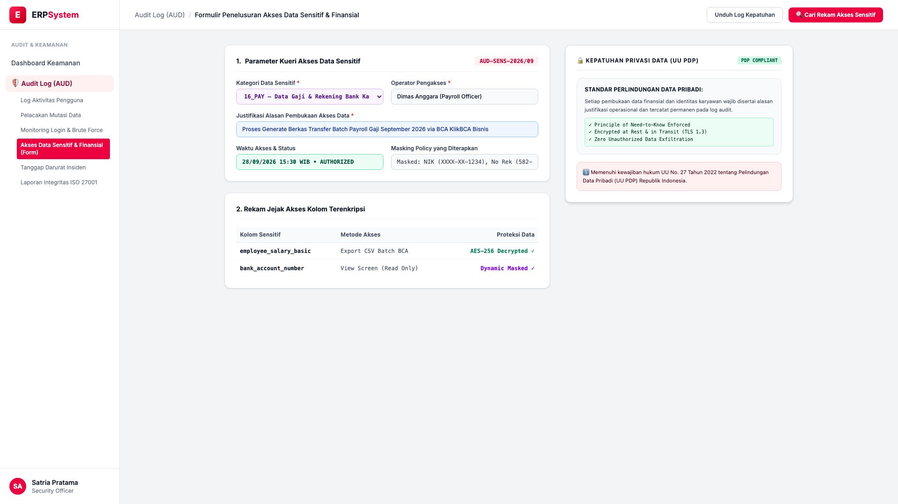
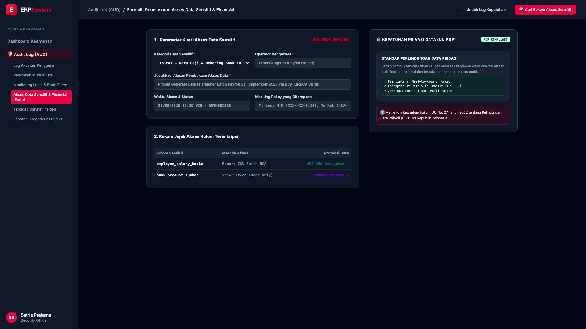

# 🎨 Design UI — Formulir Penelusuran Akses Data Sensitif (Data Entry Screen)

> Mockup antarmuka **Formulir Penelusuran Akses Data Sensitif & Finansial (Sensitive Data Access & Privacy Audit Data Entry)**: desain *Split-Screen Form* dengan formulir kueri data sensitif di sebelah kiri (Nomor Audit `AUD-SENS-2026/09`, kategori data `16_PAY` gaji & nomor rekening bank karyawan, operator Dimas Anggara Payroll Officer, justifikasi "Proses Generate Berkas Transfer Batch Payroll Gaji September 2026 via BCA KlikBCA Bisnis", waktu akses 28/09/2026 15:30 WIB AUTHORIZED, masking policy NIK `XXXX-XX-1234` dan No Rek `582-XXXX-89`, tabel akses terenkripsi AES-256) dan *Live Lembar Kepatuhan Privasi Data Pribadi (UU PDP Compliant, Need-to-Know Enforced & TLS 1.3)* di sebelah kanan pada modul `AUD` (Audit Trail & Log Keamanan) dalam ERP System.

---

## Light Mode

---

## Dark Mode

---

## 📝 Komponen & Fitur Formulir Input

1. **Panel Kiri — Formulir Parameter Akses & Justifikasi Bisnis**:
   - Kode Audit: `AUD-SENS-2026/09`.
   - Data Sensitif: `16_PAY` (Gaji Pokok & Rekening Karyawan).
   - Justifikasi: *Transfer Batch Payroll Bank BCA*.
   - Dynamic Masking: *Sensor Digit NIK & Nomor Rekening*.

2. **Panel Kanan — Sertifikat Kepatuhan UU Perlindungan Data Pribadi**:
   - Standar Hukum: **UU No. 27 Tahun 2022 (UU PDP)**.
   - Penegakan: *Need-to-Know Principle & Audit Log Append-Only*.
