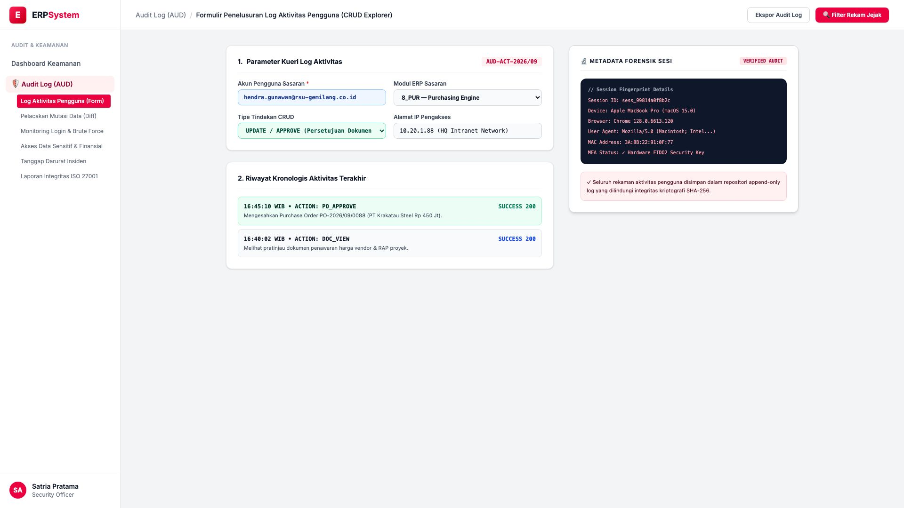
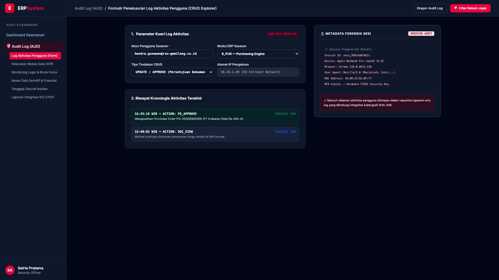

# 🎨 Design UI — Formulir Penelusuran Log Aktivitas Pengguna (Data Entry Screen)

> Mockup antarmuka **Formulir Penelusuran Log Aktivitas Pengguna (User Activity CRUD Audit Explorer Data Entry)**: desain *Split-Screen Form* dengan formulir kueri audit aktivitas di sebelah kiri (Nomor Penelusuran `AUD-ACT-2026/09`, akun pengguna sasaran `hendra.gunawan@rsu-gemilang.co.id`, modul `8_PUR`, tipe aksi UPDATE / APPROVE dokumen, IP Address `10.20.1.88`, riwayat kronologis: 16:40:02 DOC_VIEW &rarr; 16:45:10 PO_APPROVE `PO-2026/09/0088` Besi Beton Rp 450 Jt Success 200) dan *Live Pratinjau Metadata Forensik Sesi (Device MacBook Pro, Chrome 128, MAC Address `3A:8B:22...`, MFA FIDO2 Verified & Append-Only Log SHA-256)* di sebelah kanan pada modul `AUD` (Audit Trail & Log Keamanan) dalam ERP System.

---

## Light Mode

---

## Dark Mode

---

## 📝 Komponen & Fitur Formulir Input

1. **Panel Kiri — Formulir Parameter Kueri & Kronologis Aktivitas**:
   - Kode Kueri: `AUD-ACT-2026/09`.
   - User Target: `hendra.gunawan@rsu-gemilang.co.id` (Plt Dir Ops).
   - Tipe Aksi: **UPDATE / APPROVE (Persetujuan Dokumen PO)**.
   - Jejak Waktu: *28 September 2026 16:45:10 WIB (HTTP 200 OK)*.

2. **Panel Kanan — Metadata Forensik Sesi & Kriptografi**:
   - Device Fingerprint: *macOS Sonoma 15.0 &bull; Chrome 128*.
   - Keamanan Autentikasi: **Hardware FIDO2 Security Key MFA**.
   - Integritas Log: *Immutable Append-Only Audit Trail Repository*.
