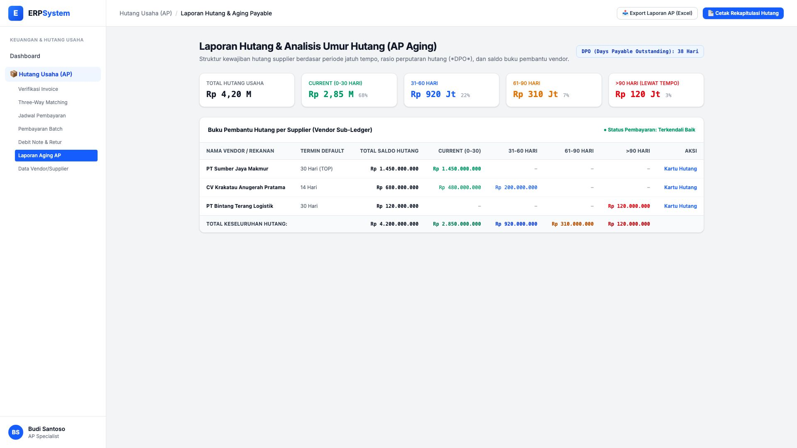
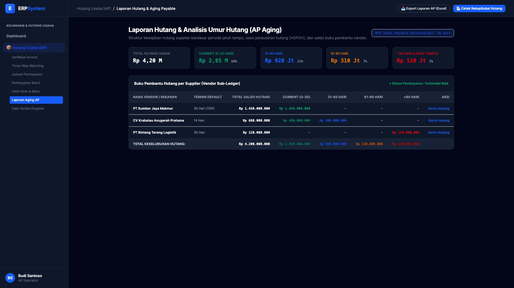

# 🎨 Design UI — Laporan Hutang & Aging Payable (AP Aging)

> Mockup antarmuka **Laporan Hutang & Analisis Umur Hutang (AP Aging & Vendor Sub-Ledger)**: distribusi kewajiban hutang supplier berdasarkan bucket waktu (*Current 0-30 hari, 31-60 hari, 61-90 hari, >90 hari*), rasio DPO (*Days Payable Outstanding*), dan rincian buku pembantu per supplier pada modul `AP` (Hutang Usaha / Accounts Payable) dalam ERP System.

---

## Light Mode

---

## Dark Mode

---

## 📊 Komponen & Fitur Utama

1. **Header & Aksi Rekapitulasi**:
   - Status: 📊 **Rasio DPO (Days Payable Outstanding): 38 Hari**.
   - Tombol **"📥 Export Laporan AP (Excel)"**: Unduh rekapitulasi hutang berformula.
   - Tombol **"📄 Cetak Rekapitulasi Hutang"** (*Primary Blue*): Cetak laporan periodik manajemen kas.

2. **Ringkasan Komposisi Umur Hutang (Aging Cards)**:
   - **Total Hutang Usaha**: Rp 4,20 Miliar
   - **Current (0-30 Hari)**: Rp 2,85 Miliar (68% - Kondisi Normal)
   - **31-60 Hari**: Rp 920 Juta (22%)
   - **61-90 Hari**: Rp 310 Juta (7%)
   - **>90 Hari (Lewat Tempo)**: Rp 120 Juta (3% - Butuh Penyelesaian)

3. **Tabel Buku Pembantu Hutang Vendor (Vendor Sub-Ledger)**:
   - Detail per supplier: PT Sumber Jaya Makmur, CV Krakatau Anugerah Pratama, PT Bintang Terang Logistik.
   - Tombol akses langsung: **Kartu Hutang** (riwayat transaksi faktur, pembayaran, dan retur).
