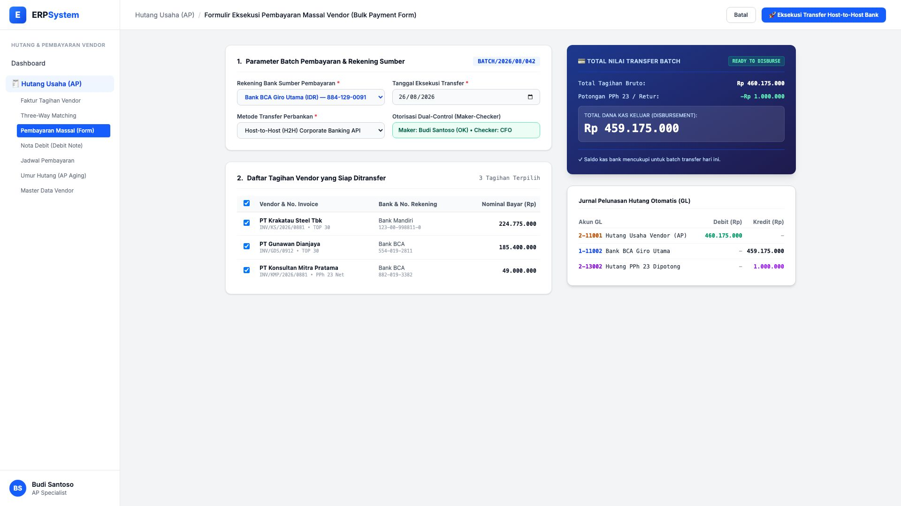

# 🎨 Design UI — Formulir Eksekusi Pembayaran Massal / Bulk Payment (Data Entry Screen)

> Mockup antarmuka **Formulir Eksekusi Pembayaran Massal Tagihan Supplier (Bulk Vendor Payments Data Entry)**: desain *Split-Screen Form* dengan formulir input batch transfer di sebelah kiri (Rekening sumber BCA Giro Utama, metode transfer H2H API / BI-Fast, checklist multi-invoice supplier Krakatau Steel & Gunawan Dianjaya) dan *Live Batch Transfer Slip, Ringkasan Pengeluaran Kas (Disbursement), & Jurnal Pelunasan Hutang Otomatis* di sebelah kanan pada modul `AP` (Hutang Usaha / Accounts Payable) dalam ERP System.

---

## Light Mode

---

## Dark Mode

---

## 📝 Komponen & Fitur Formulir Input

1. **Panel Kiri — Formulir Parameter Batch Pembayaran**:
   - Nomor Batch: `BATCH/2026/08/042`.
   - Rekening Sumber: *Bank BCA Giro Utama (IDR) — 884-129-0091*.
   - Metode Transfer: *Host-to-Host (H2H) Corporate Banking API*.
   - Checklist Tagihan: 3 Faktur Vendor (Total Tagihan Bruto Rp 460.175.000).

2. **Panel Kanan — Ringkasan Dana & Jurnal Pelunasan Hutang**:
   - Total Bruto Tagihan: Rp 460.175.000 &bull; Potongan PPh 23: -Rp 1.000.000 &bull; **Total Dana Kas Dikeluarkan: Rp 459.175.000**.
   - Jurnal Otomatis: Debit `2-11001 Hutang Usaha Vendor` (Rp 460.175.000) vs Kredit `1-11002 Bank BCA Giro` (Rp 459.175.000) & Kredit `2-13002 Hutang PPh 23` (Rp 1.000.000).
