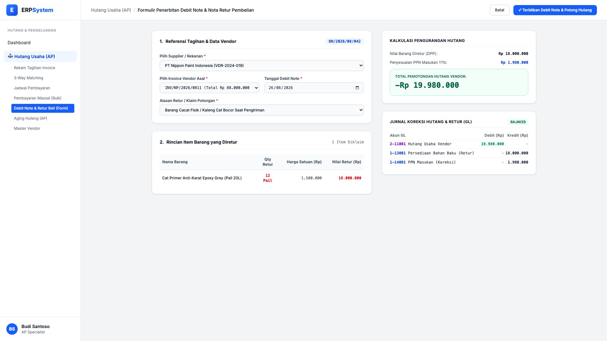

# 🎨 Design UI — Formulir Debit Note & Retur Pembelian (Data Entry Screen)

> Mockup antarmuka **Formulir Penerbitan Debit Note & Nota Retur Pembelian (Debit Note & Purchase Return Entry)**: desain *Split-Screen Form* dengan formulir input klaim retur di sebelah kiri (Pilih supplier, invoice asal, line item cacat/rusak, alasan klaim) dan *Kalkulasi Pengurangan Hutang serta Pratinjau Jurnal Koreksi GL* di sebelah kanan pada modul `AP` (Hutang Usaha / Accounts Payable) dalam ERP System.

---

## Light Mode

---

## Dark Mode

---

## 📝 Komponen & Fitur Formulir Input

1. **Panel Kiri — Formulir Pengajuan Debit Note**:
   - Pemilihan rekanan supplier & nomor invoice tagihan yang akan dipotong.
   - Dropdown Alasan Klaim: *Barang Cacat/Bocor, Salah Spesifikasi, Kelebihan Tagihan*.
   - Line items barang yang diretur (Nama barang, Qty retur, Harga satuan, Total DPP).

2. **Panel Kanan — Kalkulasi Potongan & Jurnal Koreksi Otomatis**:
   - Nilai Barang Diretur (Rp 18 Jt) + Koreksi PPN Masukan 11% (Rp 1,98 Jt) = **Total Pemotongan Hutang Vendor -Rp 19.980.000**.
   - **Pratinjau Jurnal Koreksi GL**: Debit Hutang Usaha `2-11001`, Kredit Persediaan Barang `1-13001`, Kredit PPN Masukan `1-14001`.
