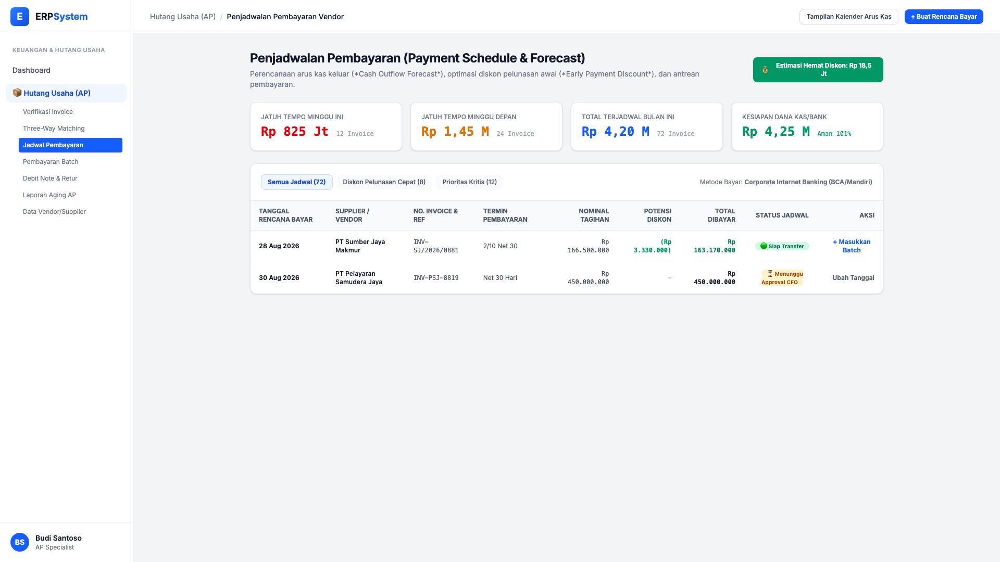
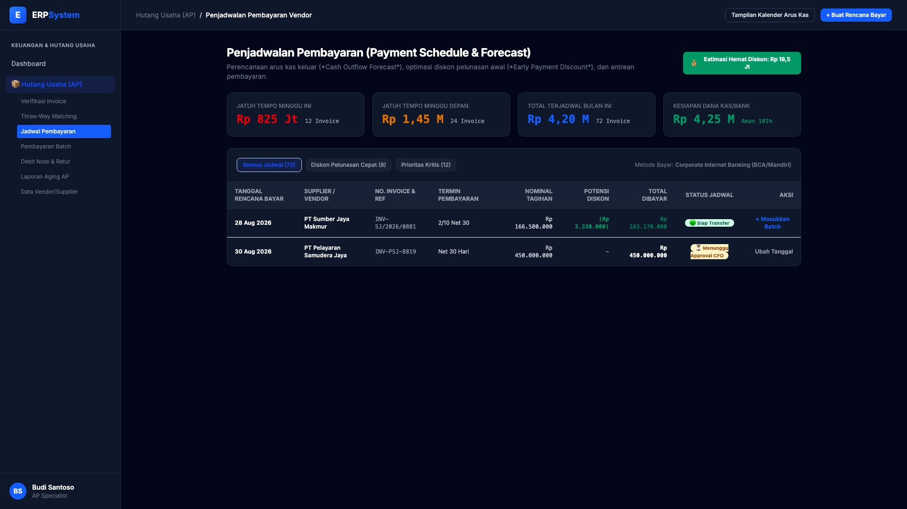

# 🎨 Design UI — Penjadwalan Pembayaran Vendor (Payment Schedule)

> Mockup antarmuka **Penjadwalan Pembayaran Supplier (Payment Scheduling & Cash Outflow Forecast)**: perkiraan arus kas keluar, pemanfaatan diskon termin pembayaran awal (*Early Payment Discount 2/10 Net 30*), dan persetujuan otorisasi jadwal bayar pada modul `AP` (Hutang Usaha / Accounts Payable) dalam ERP System.

---

## Light Mode

---

## Dark Mode

---

## 📅 Komponen & Fitur Utama

1. **Header & Optimasi Arus Kas**:
   - Status: 💰 **Estimasi Hemat Diskon Pelunasan Cepat: Rp 18.500.000**.
   - Tombol **"Tampilan Kalender Arus Kas"**: Visualisasi kalender jatuh tempo per minggu.
   - Tombol **"+ Buat Rencana Bayar"** (*Primary Blue*): Menjadwalkan tanggal eksekusi transfer dana.

2. **Ringkasan Komitmen Pembayaran (Stats Cards)**:
   - **Jatuh Tempo Minggu Ini**: Rp 825 Juta (12 Invoice)
   - **Jatuh Tempo Minggu Depan**: Rp 1,45 Miliar (24 Invoice)
   - **Total Terjadwal Bulan Ini**: Rp 4,20 Miliar (72 Invoice)
   - **Kesiapan Saldo Kas/Bank**: Rp 4,25 Miliar (🟢 *Likuiditas Aman 101%*)

3. **Tabel Antrean Jadwal Transfer & Diskon**:
   - Pemanfaatan termin `2/10 Net 30` (Diskon Rp 3.330.000 untuk PT Sumber Jaya Makmur).
   - Tindakan: *+ Masukkan Batch Transfer*, *Ubah Tanggal Bayar*, atau *Request Approval CFO*.
