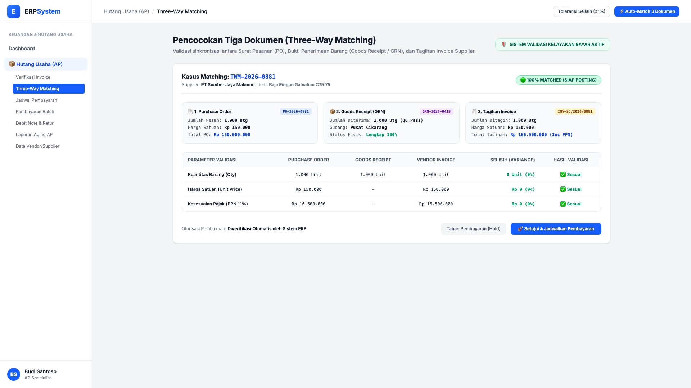
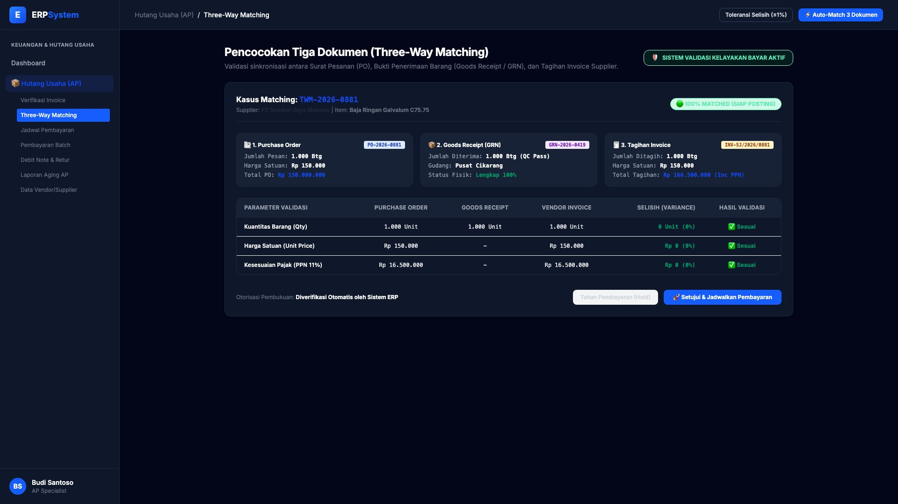

# 🎨 Design UI — Three-Way Matching (PO — GRN — Invoice)

> Mockup antarmuka **Pencocokan Tiga Dokumen (Three-Way Matching)**: validasi otomatis lintas dokumen Pesanan Pembelian (*Purchase Order*), Bukti Penerimaan Barang (*Goods Receipt Note / GRN*), dan Tagihan Supplier (*Vendor Invoice*), toleransi selisih harga/kuantitas, dan perlindungan anti kelebihan bayar pada modul `AP` (Hutang Usaha / Accounts Payable) dalam ERP System.

---

## Light Mode

---

## Dark Mode

---

## 🔍 Komponen & Fitur Utama

1. **Header & Kontrol Toleransi**:
   - Status: 🛡️ **SISTEM VALIDASI KELAYAKAN BAYAR AKTIF**
   - Tombol **"Toleransi Selisih (±1%)"**: Pengaturan batas ambang deviasi harga dan kuantitas.
   - Tombol **"⚡ Auto-Match 3 Dokumen"** (*Primary Blue*): Pencocokan otomatis satu klik.

2. **Ringkasan Tiga Dokumen Terintegrasi**:
   - **1. Purchase Order (PO-2026-0881)**: 1.000 Btg @ Rp 150.000 = Rp 150.000.000
   - **2. Goods Receipt (GRN-2026-0419)**: 1.000 Btg lolos QC di Gudang Cikarang
   - **3. Vendor Invoice (INV-SJ/2026/0881)**: 1.000 Btg @ Rp 150.000 + PPN 11% = Rp 166.500.000

3. **Matriks Validasi Parameter**:
   - Parameter dicek: Kuantitas Barang (Qty), Harga Satuan (Unit Price), dan Kesesuaian Pajak PPN 11%.
   - Hasil Selisih: **0 Unit (0%)** dan **Rp 0 (0%)** (🟢 *100% Matched — Siap Posting*).
   - Tindakan: *Tahan Pembayaran (Hold)* atau *🚀 Setujui & Jadwalkan Pembayaran*.
