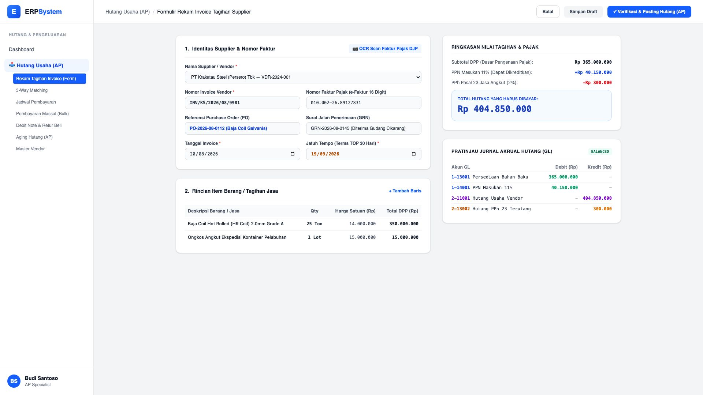

# 🎨 Design UI — Formulir Rekam Invoice Tagihan Supplier (Data Entry Screen)

> Mockup antarmuka **Formulir Rekam & Verifikasi Invoice Supplier (Vendor Invoice Data Entry)**: desain *Split-Screen Form* dengan formulir input tagihan di sebelah kiri (Pilih vendor, nomor faktur vendor, referensi PO & GRN surat jalan, line items barang/jasa, PPN 11%, dan PPh 23) dan *Kalkulator Pajak serta Pratinjau Jurnal Akrual Hutang GL* di sebelah kanan pada modul `AP` (Hutang Usaha / Accounts Payable) dalam ERP System.

---

## Light Mode

---

## Dark Mode

---

## 📝 Komponen & Fitur Formulir Input

1. **Panel Kiri — Formulir Perekaman Tagihan**:
   - Pemilihan vendor rekanan & nomor invoice faktur fisik.
   - Tombol **"📷 OCR Scan Faktur Pajak DJP"**: Pindai QR Code e-Faktur untuk mengisi data otomatis.
   - Referensi nomor Purchase Order (`PO`) dan Surat Jalan Penerimaan Barang (`GRN`).
   - Tabel multi-baris line item barang/jasa (Deskripsi, Qty, Harga Satuan, DPP).

2. **Panel Kanan — Kalkulator Pajak & Jurnal Akrual Hutang**:
   - Kalkulasi otomatis: Subtotal DPP (Rp 365 Jt) + PPN 11% (Rp 40,15 Jt) - PPh 23 (Rp 300 Rb) = **Total Hutang Rp 404.850.000**.
   - **Pratinjau Jurnal Akrual Otomatis (GL Voucher)**: Debit Persediaan Bahan Baku `1-13001`, Debit PPN Masukan `1-14001`, Kredit Hutang Usaha `2-11001`, Kredit PPh 23 Terutang `2-13002`.
