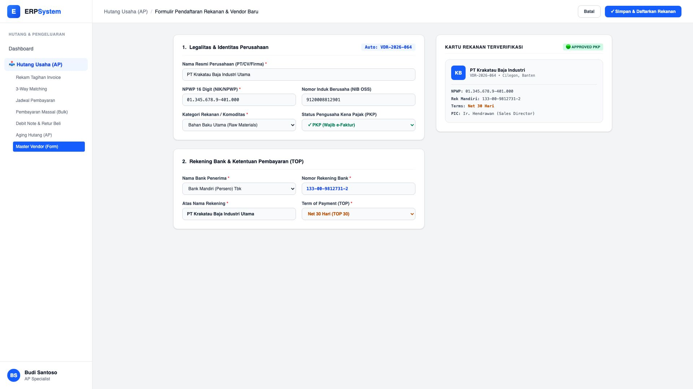
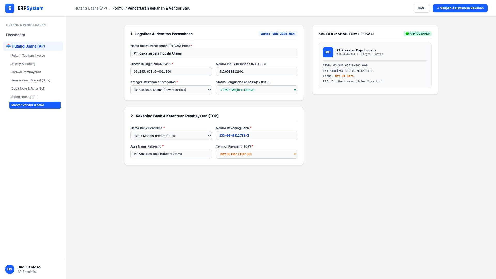

# 🎨 Design UI — Formulir Pendaftaran Rekanan / Vendor Baru (Data Entry Screen)

> Mockup antarmuka **Formulir Pendaftaran & Onboarding Vendor Baru (Vendor Registration Data Entry)**: desain *Split-Screen Form* dengan formulir input legalitas rekanan di sebelah kiri (Nama PT/CV, NPWP 16 Digit, NIB OSS, status PKP, rekening bank, syarat pembayaran TOP Net 30, dan PIC kontak) dan *Live Pratinjau Kartu Rekanan Terverifikasi* di sebelah kanan pada modul `AP` (Hutang Usaha / Accounts Payable) dalam ERP System.

---

## Light Mode

---

## Dark Mode

---

## 📝 Komponen & Fitur Formulir Input

1. **Panel Kiri — Formulir Pendaftaran Vendor**:
   - Kode Vendor Otomatis: `VDR-2026-064`.
   - Data Legalitas Perusahaan (Nama PT/CV, NPWP 16-Digit, NIB OSS, Kategori Komoditas Bahan Baku).
   - Rekening Bank Pembayaran (Nama Bank, Nomor Rekening, Atas Nama).
   - Penetapan Terms of Payment (TOP): *Net 30 Hari, Net 14 Hari, Net 60 Hari, COD*.

2. **Panel Kanan — Live Pratinjau Kartu Rekanan**:
   - Status Kepatuhan Pajak (🟢 PKP Terverifikasi).
   - Ringkasan profil vendor & PIC kontak resmi.
