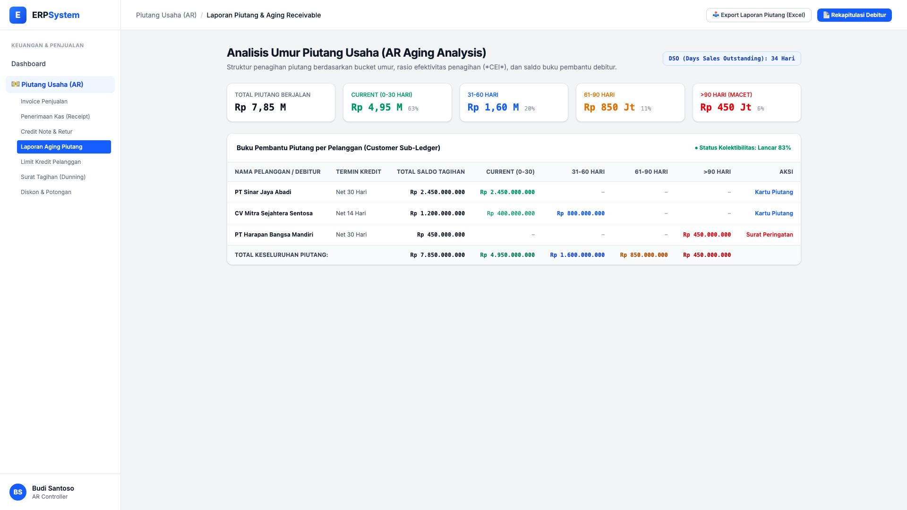
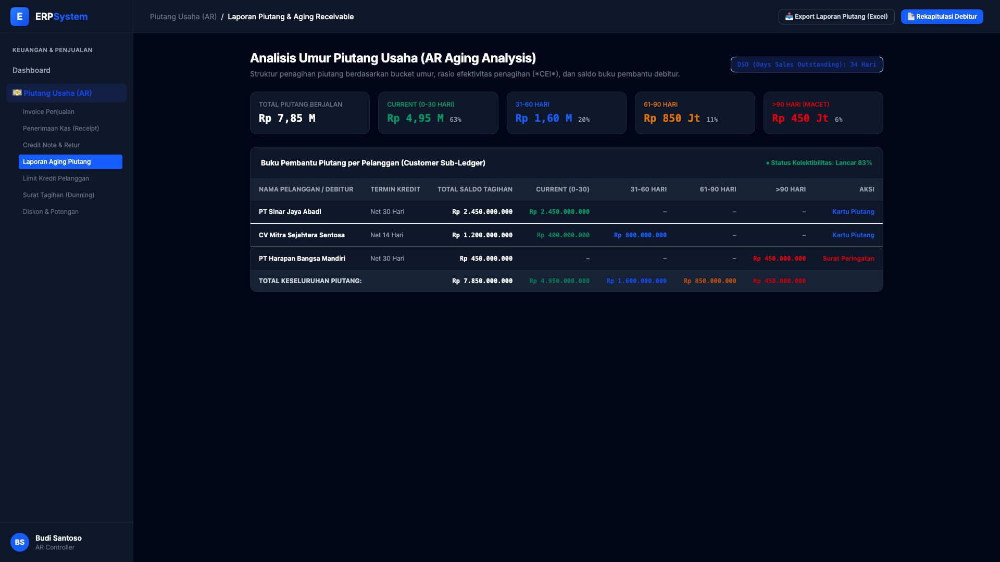

# 🎨 Design UI — Laporan Piutang & Aging Receivable (AR Aging)

> Mockup antarmuka **Laporan Piutang & Analisis Umur Piutang (AR Aging & Customer Sub-Ledger)**: klasifikasi tagihan pelanggan berdasarkan bucket umur (*Current 0-30 hari, 31-60 hari, 61-90 hari, >90 hari*), rasio DSO (*Days Sales Outstanding*), dan evaluasi kolektibilitas per debitur pada modul `AR` (Piutang Usaha / Accounts Receivable) dalam ERP System.

---

## Light Mode

---

## Dark Mode

---

## 📊 Komponen & Fitur Utama

1. **Header & Rasio Penagihan**:
   - Status: 📊 **Rasio DSO (Days Sales Outstanding): 34 Hari**.
   - Tombol **"📥 Export Laporan Piutang (Excel)"**: Unduh rekapitulasi buku pembantu piutang lengkap.
   - Tombol **"📄 Rekapitulasi Debitur"** (*Primary Blue*): Cetak portofolio tagihan beredar.

2. **Ringkasan Komposisi Piutang (Aging Cards)**:
   - **Total Piutang Berjalan**: Rp 7,85 Miliar
   - **Current (0-30 Hari)**: Rp 4,95 Miliar (63% - Sangat Lancar)
   - **31-60 Hari**: Rp 1,60 Miliar (20% - Wajar)
   - **61-90 Hari**: Rp 850 Juta (11% - Butuh Follow-up)
   - **>90 Hari (Macet)**: Rp 450 Juta (6% - Resiko Tinggi)

3. **Tabel Buku Pembantu Piutang Debitur (Customer Sub-Ledger)**:
   - Pelanggan Utama: PT Sinar Jaya Abadi, CV Mitra Sejahtera Sentosa, PT Harapan Bangsa Mandiri.
   - Tombol Tindakan: *Kartu Piutang* dan *Surat Peringatan (Somasi Penagihan)*.
