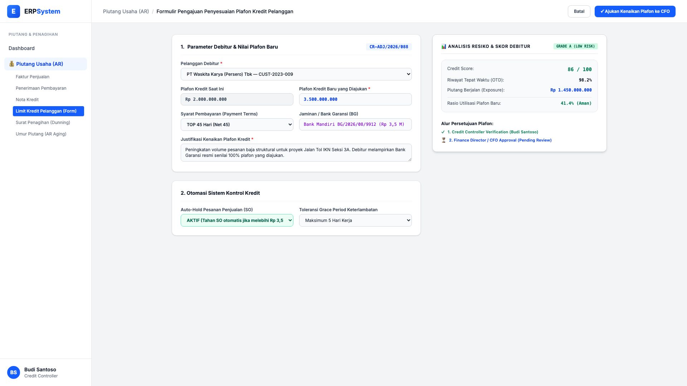

# 🎨 Design UI — Formulir Pengajuan Limit Kredit Pelanggan (Data Entry Screen)

> Mockup antarmuka **Formulir Pengajuan & Penyesuaian Plafon Kredit Debitur (Customer Credit Limit Adjustment Data Entry)**: desain *Split-Screen Form* dengan formulir input kredit di sebelah kiri (Debitur PT Waskita Karya, plafon lama Rp 2,0 M, plafon baru yang diajukan Rp 3,5 M, syarat pembayaran TOP 45 hari, jaminan Bank Garansi Mandiri Rp 3,5 M, justifikasi proyek Tol IKN) dan *Live Pratinjau Analisis Resiko Debitur (Skor Kredit 86/100 Grade A, Rasio Utilisasi 41.4%) & Stepper Persetujuan CFO* di sebelah kanan pada modul `AR` (Piutang Usaha / Accounts Receivable) dalam ERP System.

---

## Light Mode

---

## Dark Mode

---

## 📝 Komponen & Fitur Formulir Input

1. **Panel Kiri — Formulir Pengajuan Kenaikan Plafon**:
   - Debitur: `PT Waskita Karya (Persero) Tbk — CUST-2023-009`.
   - Plafon Eksisting: Rp 2.000.000.000 &bull; **Plafon Diajukan: Rp 3.500.000.000**.
   - Syarat Pembayaran: *TOP 45 Hari (Net 45)* &bull; Jaminan: *Bank Garansi Mandiri Rp 3,5 M*.
   - Otomasi Kredit: **Auto-Hold Sales Order AKTIF** jika total piutang &gt; Rp 3,5 Miliar.

2. **Panel Kanan — Analisis Resiko & Persetujuan CFO**:
   - Skor Kredit: **86 / 100 (GRADE A - LOW RISK)** &bull; OTD Pembayaran: **98.2%**.
   - Stepper Otorisasi: Verifikasi Credit Controller (Budi Santoso) &rarr; Persetujuan Direktur Keuangan (CFO).
