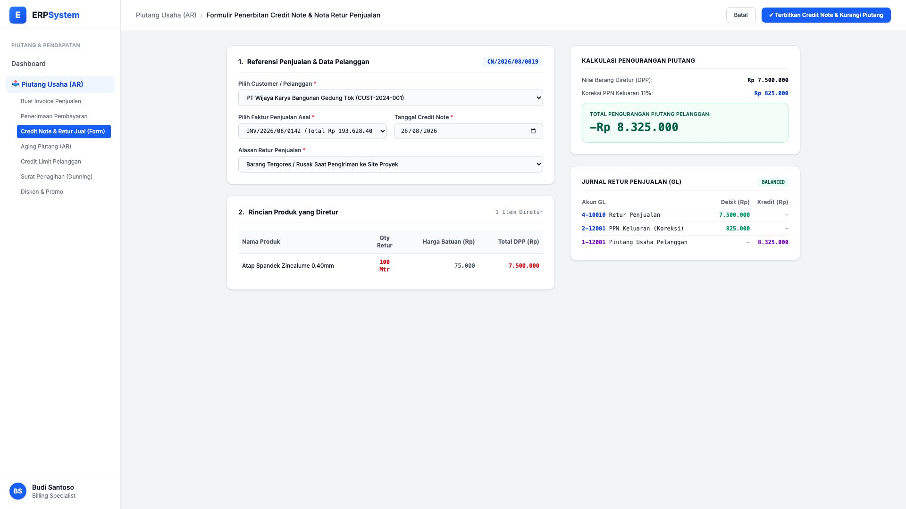

# 🎨 Design UI — Formulir Credit Note & Retur Penjualan (Data Entry Screen)

> Mockup antarmuka **Formulir Penerbitan Credit Note & Retur Penjualan (Credit Note & Sales Return Data Entry)**: desain *Split-Screen Form* dengan formulir input retur di sebelah kiri (Pilih customer, invoice asal, line item produk yang diretur, alasan cacat fisik/salah order) dan *Kalkulator Pengurangan Piutang serta Pratinjau Jurnal Retur Penjualan GL* di sebelah kanan pada modul `AR` (Piutang Usaha / Accounts Receivable) dalam ERP System.

---

## Light Mode

---

## Dark Mode

---

## 📝 Komponen & Fitur Formulir Input

1. **Panel Kiri — Formulir Pengajuan Credit Note**:
   - Nomor Dokumen Otomatis: `CN/2026/08/0019`.
   - Pemilihan Pelanggan & Nomor Faktur Penjualan Asal (`INV/2026/08/0142`).
   - Line items produk yang dikembalikan (Atap Spandek 100 Mtr @ Rp 75.000 = Rp 7.500.000).
   - Alasan Retur: *Barang Tergores / Rusak Saat Pengiriman ke Site Proyek*.

2. **Panel Kanan — Kalkulasi Pengurangan Piutang & Jurnal GL**:
   - Nilai Barang Diretur (Rp 7,5 Jt) + Koreksi PPN Keluaran 11% (Rp 825 Rb) = **Total Pengurangan Piutang Pelanggan -Rp 8.325.000**.
   - **Pratinjau Jurnal Retur Penjualan (GL)**: Debit Retur Penjualan `4-10010`, Debit PPN Keluaran `2-12001`, Kredit Piutang Usaha Pelanggan `1-12001`.
