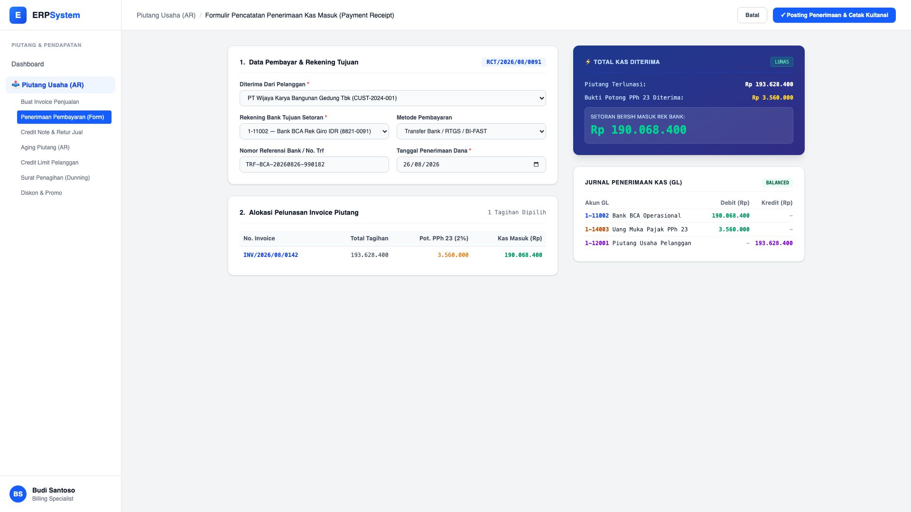
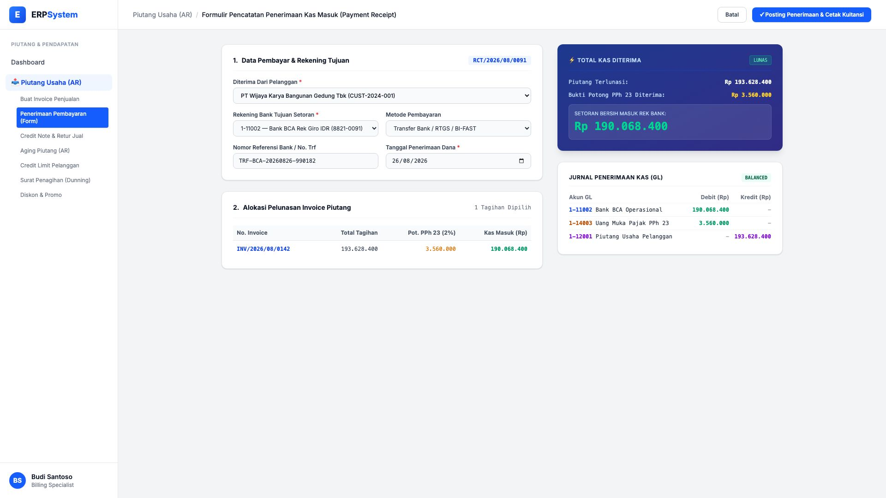

# 🎨 Design UI — Formulir Penerimaan Kas Masuk & Pelunasan Piutang (Data Entry Screen)

> Mockup antarmuka **Formulir Pencatatan Penerimaan Pembayaran Pelanggan (Payment Receipt & AR Settlement Entry)**: desain *Split-Screen Form* dengan formulir input setoran kas di sebelah kiri (Pilih customer pembayar, rekening bank tujuan BCA, nomor referensi transfer, alokasi invoice yang dilunasi, pemotongan PPh 23) dan *Ringkasan Setoran Bersih & Pratinjau Jurnal Kas Masuk GL* di sebelah kanan pada modul `AR` (Piutang Usaha / Accounts Receivable) dalam ERP System.

---

## Light Mode

---

## Dark Mode

---

## 📝 Komponen & Fitur Formulir Input

1. **Panel Kiri — Formulir Kas Masuk**:
   - Nomor Kuitansi Otomatis: `RCT/2026/08/0091`.
   - Pemilihan Pelanggan (PT Wijaya Karya).
   - Rekening Bank Tujuan: `1-11002 — Bank BCA Rek Giro IDR`.
   - Tabel alokasi pelunasan tagihan invoice: Tagihan Rp 193.628.400, Bukti Potong PPh 23 (2%) Rp 3.560.000, Setoran Bersih Rp 190.068.400.

2. **Panel Kanan — Ringkasan Setoran & Jurnal Pelunasan Piutang**:
   - Status Pelunasan: 🟢 **LUNAS**.
   - **Pratinjau Jurnal Kas Masuk GL**: Debit Bank BCA `1-11002`, Debit Uang Muka PPh 23 `1-14003`, Kredit Piutang Usaha Pelanggan `1-12001`.
