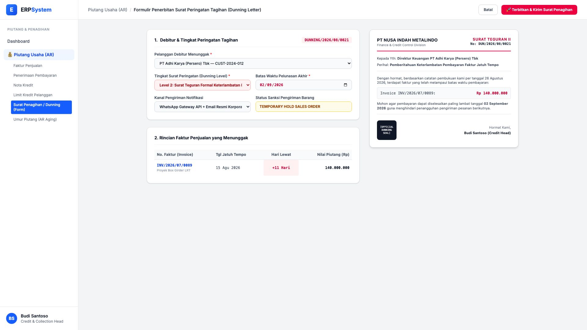

# 🎨 Design UI — Formulir Surat Penagihan Dunning (Data Entry Screen)

> Mockup antarmuka **Formulir Penerbitan Surat Peringatan & Somasi Tagihan (Automated Dunning Letter Data Entry)**: desain *Split-Screen Form* dengan formulir input penagihan di sebelah kiri (Pilihan debitur menunggak PT Adhi Karya, tingkatan surat dunning Level 2 Surat Teguran Keras, batas waktu pelunasan, kanal WhatsApp/Email, invoice tunggakan INV/2026/07/0089 Rp 140 Jt) dan *Live Pratinjau Surat Teguran Resmi Penagihan Piutang (Kop Perusahaan, Nomor Surat, Rincian Tagihan, Sanksi Penahanan Pengiriman)* di sebelah kanan pada modul `AR` (Piutang Usaha / Accounts Receivable) dalam ERP System.

---

## Light Mode

---

## Dark Mode

---

## 📝 Komponen & Fitur Formulir Input

1. **Panel Kiri — Formulir Parameter Surat Peringatan (Dunning)**:
   - Debitur Menunggak: `PT Adhi Karya (Persero) Tbk — CUST-2024-012`.
   - Tingkat Dunning: **Level 2: Surat Teguran Formal Keterlambatan (H+7)**.
   - Batas Pelunasan: **02 September 2026** &bull; Status: **Temporary Hold Sales Order**.
   - Faktur Terkait: `INV/2026/07/0089` (Rp 140.000.000, lewat 11 hari).

2. **Panel Kanan — Live Pratinjau Surat Teguran Resmi**:
   - Pratinjau surat resmi berkop perusahaan lengkap dengan cap otorisasi divisi kredit & piutang.
   - Pengiriman otomatis multi-kanal via WhatsApp Gateway API & PDF Lampiran Email resmi.
