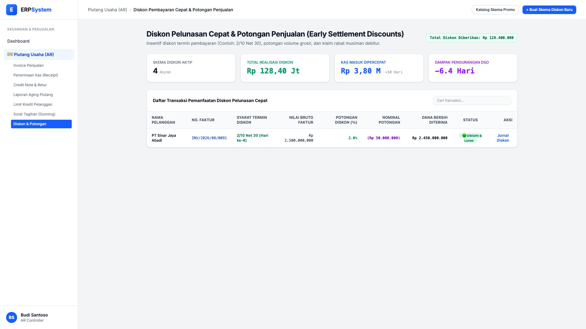
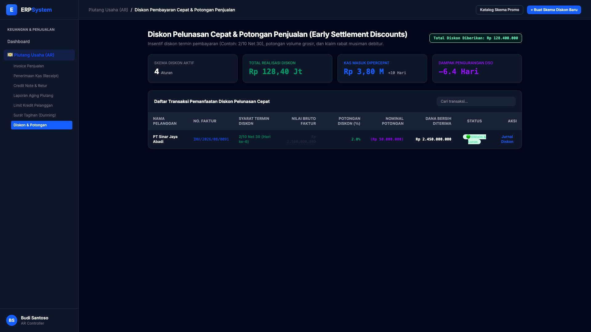

# 🎨 Design UI — Diskon & Potongan Penjualan (Early Settlement Discounts)

> Mockup antarmuka **Diskon Pelunasan Cepat & Potongan Penjualan (Early Settlement Discounts & Sales Allowances)**: insentif syarat termin pelunasan piutang dipercepat (seperti *2/10 Net 30*), potongan volume grosir, klaim rabat debitur, dan perhitungan otomatis kas bersih masuk pada modul `AR` (Piutang Usaha / Accounts Receivable) dalam ERP System.

---

## Light Mode

---

## Dark Mode

---

## 🏷️ Komponen & Fitur Utama

1. **Header & Nilai Realisasi Diskon**:
   - Status: 🟢 **Total Diskon Pelunasan Diberikan: Rp 128.400.000**.
   - Tombol **"Katalog Skema Promo"**: Manajemen aturan potongan harga & insentif termin kredit.
   - Tombol **"+ Buat Skema Diskon Baru"** (*Primary Blue*): Konfigurasi diskon pelunasan kas.

2. **Ringkasan Dampak Finansial (Stats Cards)**:
   - **Skema Diskon Aktif**: 4 Aturan Termin
   - **Total Realisasi Diskon**: Rp 128,40 Juta
   - **Kas Masuk Dipercepat (<10 Hari)**: Rp 3,80 Miliar
   - **Dampak Penurunan DSO**: -6.4 Hari (Perputaran Kas Jauh Lebih Cepat)

3. **Tabel Transaksi Diskon Pelunasan**:
   - Menampilkan: *Nama Debitur, No Faktur, Syarat Termin (2/10 Net 30), Nilai Bruto Faktur, Potongan Diskon %, Nominal Potongan, Dana Bersih Diterima, dan Status*.
