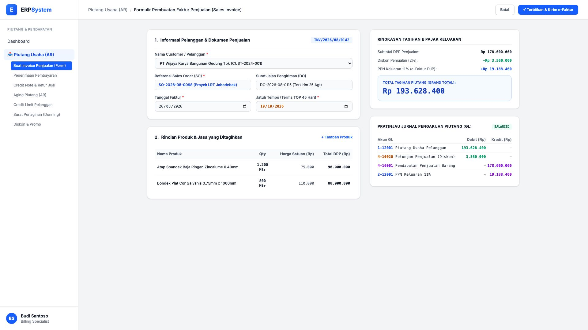

# 🎨 Design UI — Formulir Pembuatan Sales Invoice (Data Entry Screen)

> Mockup antarmuka **Formulir Pembuatan Faktur Penjualan (Sales Invoice Data Entry)**: desain *Split-Screen Form* dengan formulir penagihan di sebelah kiri (Pemilihan customer, referensi Sales Order SO, surat jalan DO, line items produk baja/spandek, diskon penjualan, PPN Keluaran 11%) dan *Kalkulator Total Tagihan & Pratinjau Jurnal Piutang GL* di sebelah kanan pada modul `AR` (Piutang Usaha / Accounts Receivable) dalam ERP System.

---

## Light Mode

---

## Dark Mode

---

## 📝 Komponen & Fitur Formulir Input

1. **Panel Kiri — Formulir Faktur Penjualan**:
   - Nomor Faktur Otomatis: `INV/2026/08/0142`.
   - Pemilihan Pelanggan / Proyek Klien (PT Wijaya Karya).
   - Referensi nomor Sales Order (`SO`) dan Delivery Order (`DO`).
   - Line items multi-produk (Atap Spandek, Bondek Cor Plat) dengan perhitungan DPP.

2. **Panel Kanan — Ringkasan Tagihan & Jurnal Piutang Usaha**:
   - Subtotal DPP (Rp 178 Jt) - Diskon 2% (Rp 3,56 Jt) + PPN 11% (Rp 19,18 Jt) = **Grand Total Tagihan Piutang Rp 193.628.400**.
   - **Pratinjau Jurnal Penjualan GL**: Debit Piutang Usaha `1-12001`, Debit Potongan Penjualan `4-10020`, Kredit Pendapatan Penjualan `4-10001`, Kredit PPN Keluaran `2-12001`.
