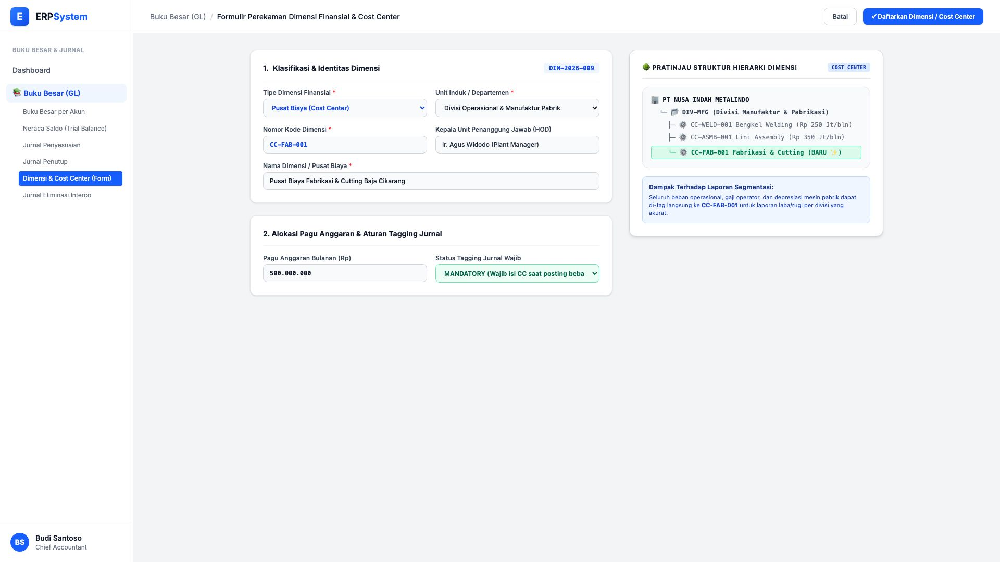
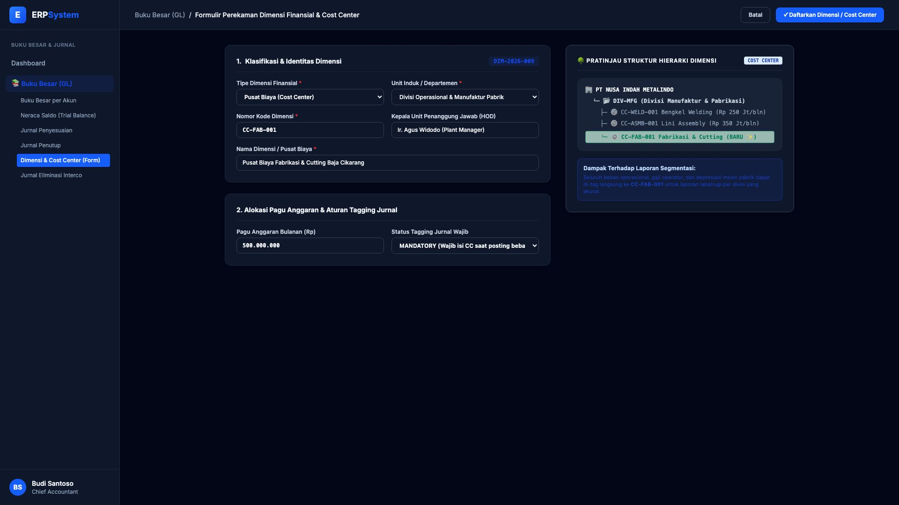

# 🎨 Design UI — Formulir Perekaman Dimensi Finansial & Cost Center (Data Entry Screen)

> Mockup antarmuka **Formulir Perekaman Master Dimensi Akuntansi & Pusat Biaya (Accounting Dimensions & Cost Center Data Entry)**: desain *Split-Screen Form* dengan formulir input dimensi di sebelah kiri (Tipe Pusat Biaya / Cost Center, Departemen Induk Divisi Manufaktur, Kode Dimensi CC-FAB-001, Penanggung Jawab Ir. Agus Widodo, Pagu Anggaran Bulanan Rp 500 Juta, Status Tagging Wajib Mandatory) dan *Live Pratinjau Pohon Hierarki Dimensi (Cost Center Tree) & Dampak Laporan Segmentasi* di sebelah kanan pada modul `GL` (Buku Besar / General Ledger) dalam ERP System.

---

## Light Mode

---

## Dark Mode

---

## 📝 Komponen & Fitur Formulir Input

1. **Panel Kiri — Formulir Master Dimensi & Pusat Biaya**:
   - Tipe: **Pusat Biaya (Cost Center)** &bull; Unit Induk: *Divisi Manufaktur Pabrik*.
   - Kode Dimensi: `CC-FAB-001` &bull; Nama: *Pusat Biaya Fabrikasi & Cutting Baja Cikarang*.
   - Pagu Anggaran: **Rp 500.000.000 / Bulan** &bull; Tagging: **MANDATORY (Wajib)**.

2. **Panel Kanan — Live Pohon Hierarki & Pemetaan Segmentasi**:
   - Struktur Induk-Anak: Menampilkan letak `CC-FAB-001` di bawah `DIV-MFG`.
   - Mengintegrasikan tagging transaksi GL langsung ke laporan rugi laba per departemen/proyek.
