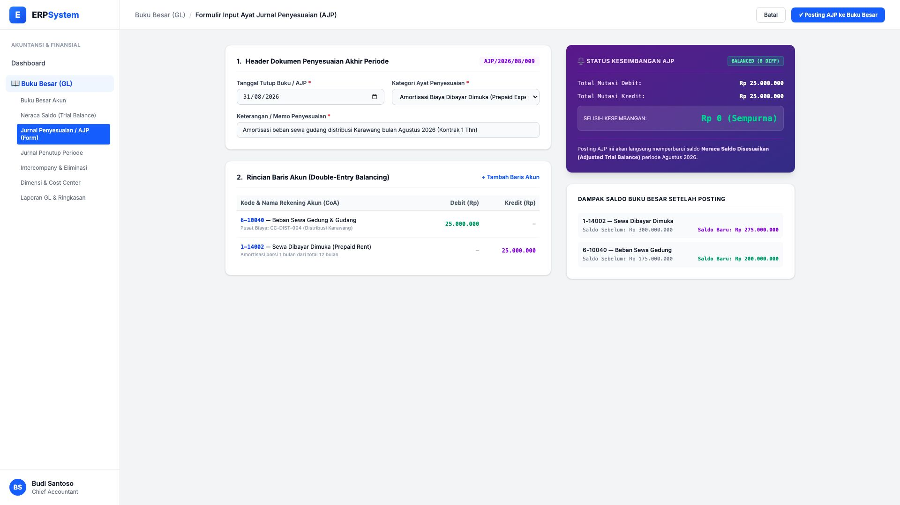
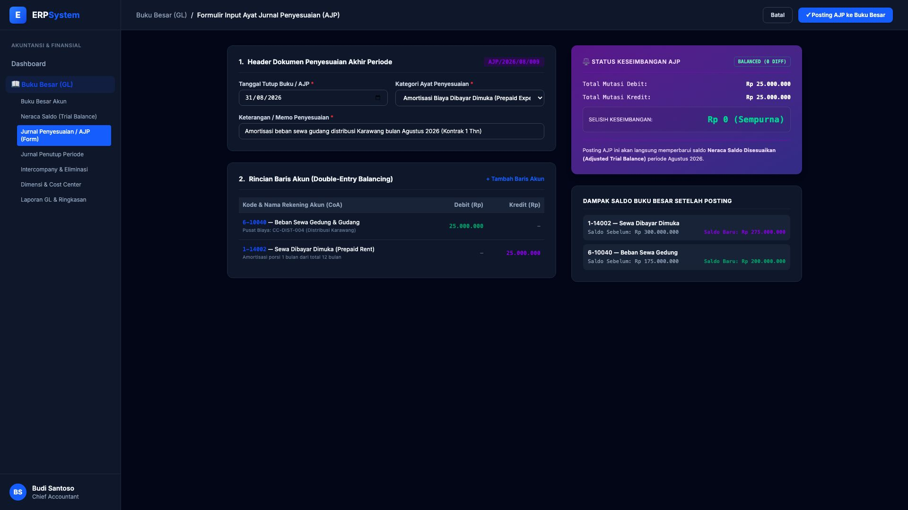

# 🎨 Design UI — Formulir Input Jurnal Penyesuaian / AJP (Data Entry Screen)

> Mockup antarmuka **Formulir Input Ayat Jurnal Penyesuaian Akhir Periode (Adjusting Journal Entry Data Entry)**: desain *Split-Screen Form* dengan formulir entri akun multi-baris di sebelah kiri (Pilih kategori penyesuaian, tanggal tutup buku, deskripsi amortisasi sewa dibayar dimuka, baris debit beban vs kredit aset) dan *Status Keseimbangan Zero-Difference Balance Guard & Pratinjau Dampak Saldo Buku Besar* di sebelah kanan pada modul `GL` (Buku Besar / General Ledger) dalam ERP System.

---

## Light Mode

---

## Dark Mode

---

## 📝 Komponen & Fitur Formulir Input

1. **Panel Kiri — Formulir Penginputan AJP**:
   - Nomor Voucher Otomatis: `AJP/2026/08/009`.
   - Tanggal Tutup Periode Fiskal: 31 Agustus 2026.
   - Kategori Penyesuaian: *Amortisasi Biaya Dibayar Dimuka (Prepaid Expense)*.
   - Baris Akun Debit/Kredit:
     - Debit `6-10040 — Beban Sewa Gedung & Gudang` (Rp 25.000.000)
     - Kredit `1-14002 — Sewa Dibayar Dimuka` (Rp 25.000.000)

2. **Panel Kanan — Validasi Keseimbangan & Dampak Audit GL**:
   - Status Keseimbangan: 🟢 **BALANCED (0 DIFF)**.
   - Perbandingan dampak mutasi saldo akun: *Sewa Dibayar Dimuka berkurang dari Rp 300 Jt -> Rp 275 Jt, Beban Sewa bertambah menjadi Rp 200 Jt*.
