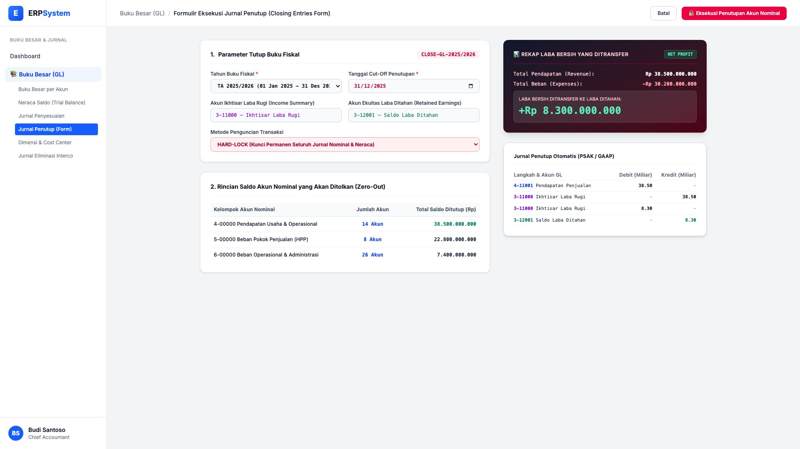
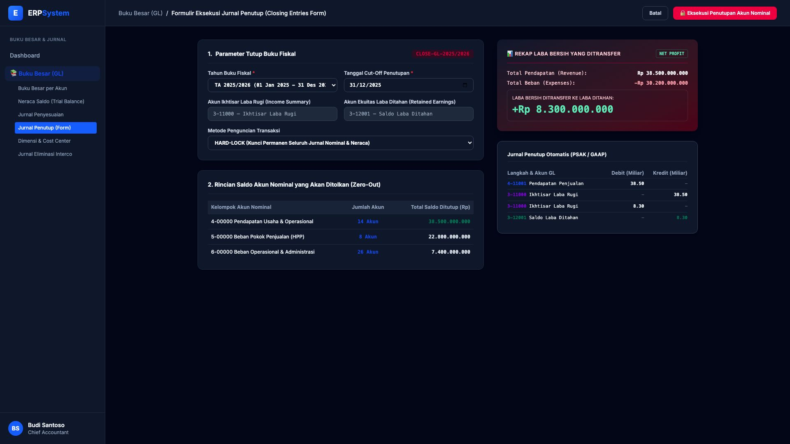

# 🎨 Design UI — Formulir Eksekusi Jurnal Penutup (Data Entry Screen)

> Mockup antarmuka **Formulir Eksekusi Jurnal Penutup Akhir Periode (Closing Entries Data Entry)**: desain *Split-Screen Form* dengan formulir input tutup buku di sebelah kiri (Tahun buku fiskal 2025/2026, tanggal cut-off 31 Des 2025, pemetaan akun Ikhtisar Laba Rugi 3-11000, akun Laba Ditahan 3-12001, opsi Hard-Lock penguncian transaksi) dan *Live Pratinjau 3 Langkah Jurnal Penutup PSAK (Tutup Pendapatan Rp 38,5 M, Beban Rp 30,2 M, Transfer Laba Bersih Rp 8,3 M) & Ringkasan Laba Bersih* di sebelah kanan pada modul `GL` (Buku Besar / General Ledger) dalam ERP System.

---

## Light Mode

---

## Dark Mode

---

## 📝 Komponen & Fitur Formulir Input

1. **Panel Kiri — Formulir Parameter Tutup Buku**:
   - Periode: `TA 2025/2026 (01 Jan 2025 - 31 Des 2025)`.
   - Tanggal Cut-Off: `2025-12-31`.
   - Akun Perantara: `3-11000 — Ikhtisar Laba Rugi (Income Summary)`.
   - Akun Ekuitas: `3-12001 — Saldo Laba Ditahan (Retained Earnings)`.
   - Metode Kunci: **HARD-LOCK (Kunci Permanen Jurnal Transaksi)**.

2. **Panel Kanan — 3-Step Closing Entries & Transfer Laba**:
   - Total Pendapatan: **Rp 38,50 Miliar** &bull; Total Beban: **Rp 30,20 Miliar**.
   - **Laba Bersih Ditransfer ke Ekuitas: +Rp 8.300.000.000 (Net Profit)**.
   - Jurnal Otomatis PSAK/GAAP yang menolkan (*zero-out*) seluruh akun nominal secara instan.
