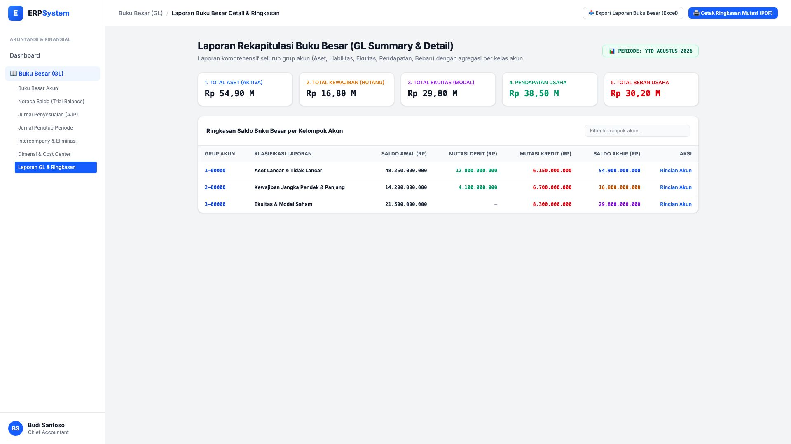
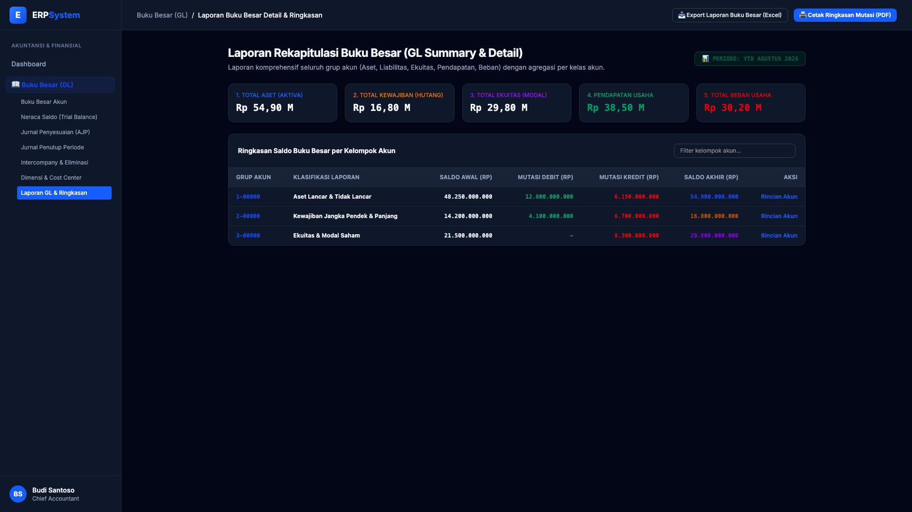

# 🎨 Design UI — Laporan Buku Besar Detail & Ringkasan

> Mockup antarmuka **Laporan Rekapitulasi & Mutasi Buku Besar (GL Summary & Detail Report)**: agregasi saldo per kelompok akun (Aset, Liabilitas, Ekuitas, Pendapatan, Beban), perbandingan mutasi debit/kredit YTD, dan analisis audit drill-down akun pada modul `GL` (Buku Besar / General Ledger) dalam ERP System.

---

## Light Mode

---

## Dark Mode

---

## 📊 Komponen & Fitur Utama

1. **Header & Periode Buku Besar**:
   - Status: 📊 **PERIODE: YTD AGUSTUS 2026**.
   - Tombol **"📥 Export Laporan Buku Besar (Excel)"**: Unduh format pivot table keuangan.
   - Tombol **"🖨️ Cetak Ringkasan Mutasi (PDF)"** (*Primary Blue*): Laporan ringkasan bulanan manajemen.

2. **Ringkasan Saldo 5 Kelas Akun (Stats Cards)**:
   - **1. Total Aset (Aktiva)**: Rp 54,90 Miliar
   - **2. Total Kewajiban (Hutang)**: Rp 16,80 Miliar
   - **3. Total Ekuitas (Modal)**: Rp 29,80 Miliar
   - **4. Pendapatan Usaha**: Rp 38,50 Miliar
   - **5. Total Beban Usaha**: Rp 30,20 Miliar

3. **Tabel Ringkasan Grup Akun Induk**:
   - Menampilkan: *Grup Akun, Klasifikasi Laporan, Saldo Awal, Mutasi Debit, Mutasi Kredit, Saldo Akhir, dan Aksi Rincian Akun*.
