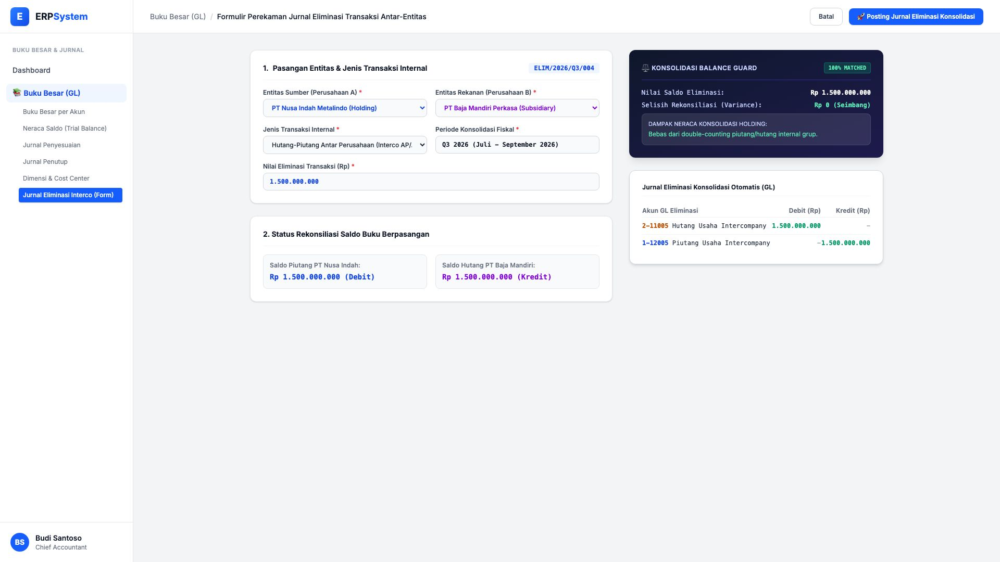
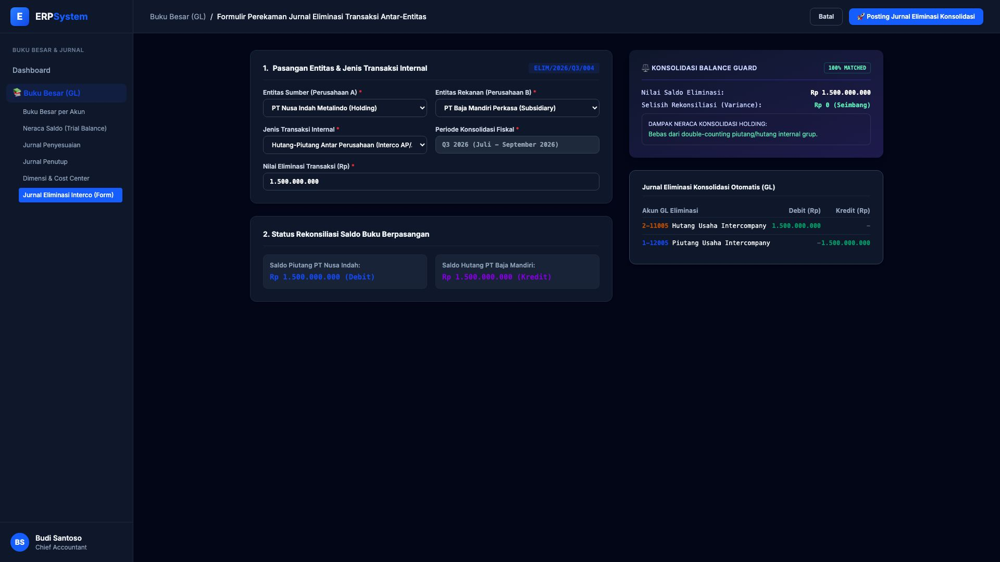

# 🎨 Design UI — Formulir Jurnal Eliminasi Intercompany (Data Entry Screen)

> Mockup antarmuka **Formulir Perekaman Jurnal Eliminasi Transaksi Antar-Entitas (Intercompany Elimination Entries Data Entry)**: desain *Split-Screen Form* dengan formulir input eliminasi di sebelah kiri (Entitas Induk PT Nusa Indah Metalindo vs Anak PT Baja Mandiri Perkasa, jenis transaksi hutang-piutang intercompany, periode konsolidasi Q3 2026, nilai eliminasi Rp 1,5 Miliar) dan *Live Pratinjau Jurnal Eliminasi Berpasangan (Debit Hutang Interco vs Kredit Piutang Interco Rp 1,5 M, Selisih Rp 0) & Balance Guard Konsolidasi* di sebelah kanan pada modul `GL` (Buku Besar / General Ledger) dalam ERP System.

---

## Light Mode

---

## Dark Mode

---

## 📝 Komponen & Fitur Formulir Input

1. **Panel Kiri — Formulir Eliminasi Transaksi Antar-Perusahaan**:
   - Entitas Sumber: *PT Nusa Indah Metalindo (Holding)*.
   - Entitas Rekanan: *PT Baja Mandiri Perkasa (Subsidiary)*.
   - Jenis: *Hutang-Piutang Antar Perusahaan (Interco AP/AR)* &bull; Periode: *Q3 2026*.
   - Nilai Transaksi: **Rp 1.500.000.000 (100% Matched Rekonsiliasi)**.

2. **Panel Kanan — Jurnal Eliminasi & Konsolidasi Guard**:
   - Selisih Rekonsiliasi: **Rp 0 (Status: 100% MATCHED)**.
   - Jurnal Otomatis Konsolidasi: Debit `2-11005 Hutang Usaha Intercompany` (Rp 1,5 M) vs Kredit `1-12005 Piutang Usaha Intercompany` (Rp 1,5 M) &mdash; menghapus risiko *double-counting* pada Laporan Keuangan Konsolidasi Grup.
