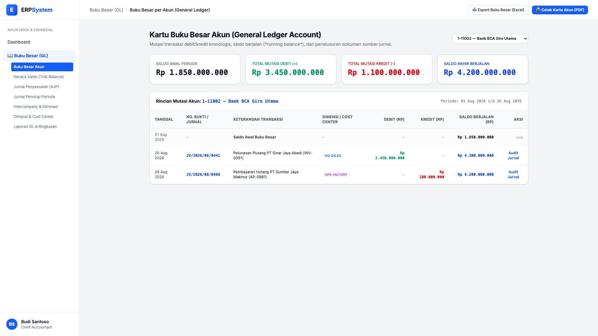
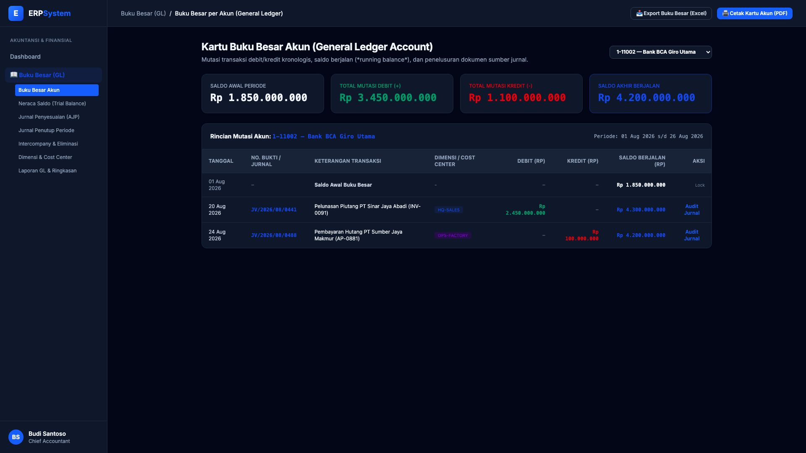

# 🎨 Design UI — Buku Besar per Akun (General Ledger Account)

> Mockup antarmuka **Kartu Buku Besar Akun (General Ledger Account & Mutation Ledger)**: pencatatan kronologis mutasi debit/kredit per akun CoA, penelusuran dokumen sumber transaksi (*Drill-down to Journal / Source Document*), dimensi akuntansi / cost center, dan saldo akhir berjalan (*Running Balance*) pada modul `GL` (Buku Besar / General Ledger) dalam ERP System.

---

## Light Mode

---

## Dark Mode

---

## 📖 Komponen & Fitur Utama

1. **Header & Seleksi Akun Buku Besar**:
   - Pilihan Akun Aktif: `1-11002 — Bank BCA Giro Utama`.
   - Tombol **"📥 Export Buku Besar (Excel)"**: Unduh format rincian GL berformula.
   - Tombol **"🖨️ Cetak Kartu Akun (PDF)"** (*Primary Blue*): Cetak kartu buku besar resmi.

2. **Ringkasan Mutasi Akun (Stats Cards)**:
   - **Saldo Awal Periode**: Rp 1.850.000.000
   - **Total Mutasi Debit (+)**: Rp 3.450.000.000
   - **Total Mutasi Kredit (-)**: Rp 1.100.000.000
   - **Saldo Akhir Berjalan**: Rp 4.200.000.000

3. **Tabel Mutasi Kronologis**:
   - Kolom: *Tanggal, No. Bukti Jurnal, Keterangan Transaksi, Dimensi/Cost Center, Debit, Kredit, Saldo Berjalan, dan Aksi Audit Jurnal*.
