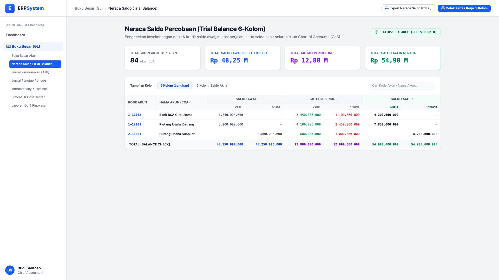
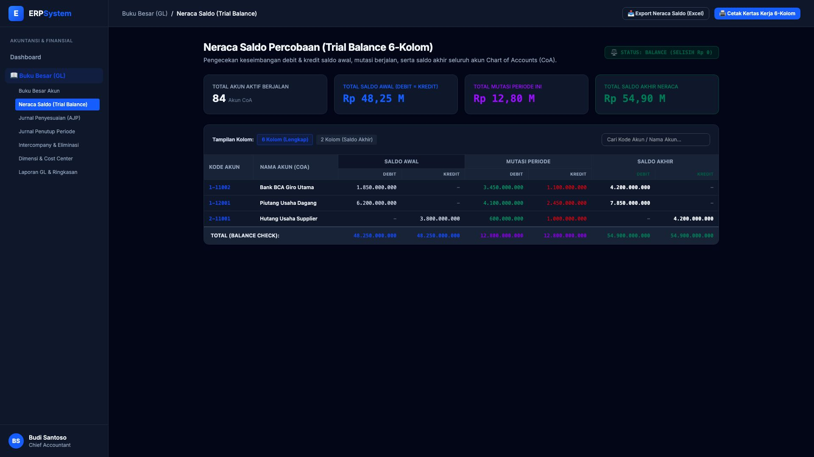

# 🎨 Design UI — Neraca Saldo (Trial Balance)

> Mockup antarmuka **Neraca Saldo Percobaan 6-Kolom (Trial Balance & Balance Verification)**: rekapitulasi keseimbangan debit dan kredit seluruh akun buku besar (Saldo Awal, Mutasi Periode, dan Saldo Akhir), deteksi selisih otomatis (*Zero Discrepancy Balance Check*), dan kertas kerja audit pada modul `GL` (Buku Besar / General Ledger) dalam ERP System.

---

## Light Mode

---

## Dark Mode

---

## ⚖️ Komponen & Fitur Utama

1. **Header & Status Keseimbangan**:
   - Status Validasi: ⚖️ **STATUS: BALANCE (SELISIH Rp 0)**.
   - Pilihan Tampilan: *6 Kolom (Lengkap)* atau *2 Kolom (Saldo Akhir)*.
   - Tombol **"📥 Export Neraca Saldo (Excel)"** & **"🖨️ Cetak Kertas Kerja 6-Kolom"**.

2. **Ringkasan Neraca Saldo (Stats Cards)**:
   - **Total Akun Aktif**: 84 Akun CoA
   - **Total Saldo Awal**: Rp 48,25 M (Debit = Kredit)
   - **Total Mutasi Periode**: Rp 12,80 M (Debit = Kredit)
   - **Total Saldo Akhir Neraca**: Rp 54,90 M (Debit = Kredit)

3. **Tabel Kertas Kerja 6-Kolom**:
   - Kolom: *Kode Akun, Nama Akun, Saldo Awal (D/K), Mutasi Periode (D/K), dan Saldo Akhir (D/K)*.
