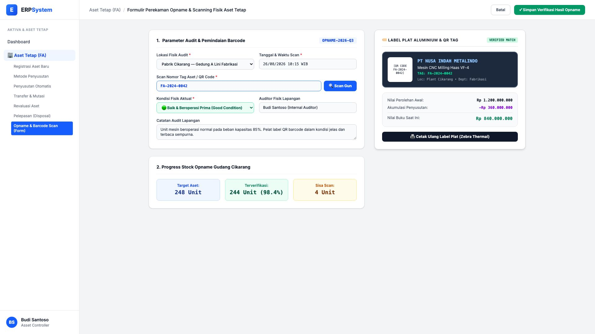
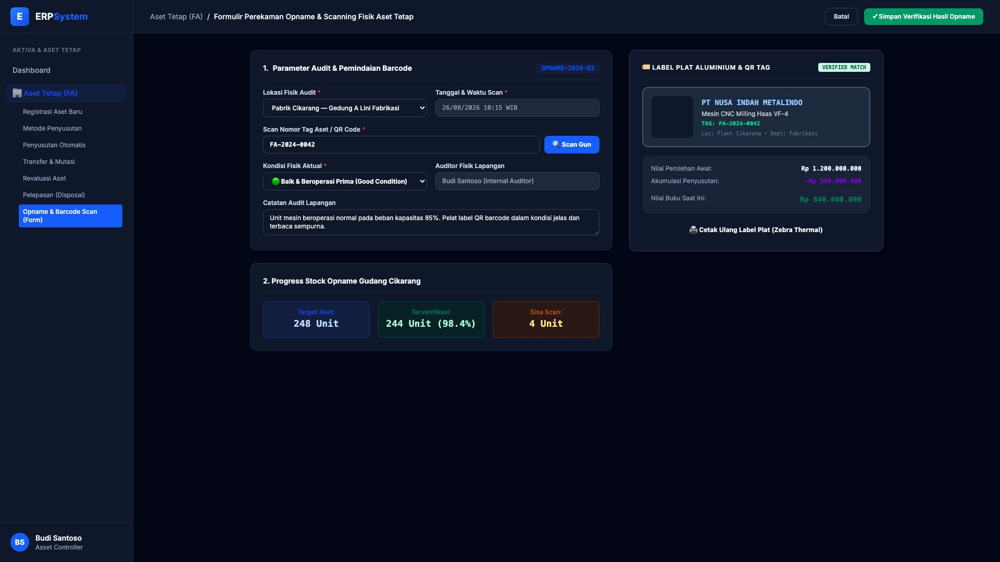

# 🎨 Design UI — Formulir Stock Opname & Scan Barcode Aset (Data Entry Screen)

> Mockup antarmuka **Formulir Perekaman Stock Opname & Pemindaian Barcode/QR Aset Tetap (Physical Asset Audit & Barcode Scan Data Entry)**: desain *Split-Screen Form* dengan formulir input pemindaian di sebelah kiri (Lokasi audit Plant Cikarang, nomor tag aset `FA-2024-0042`, tombol Scan Gun, verifikasi kondisi fisik aktual, catatan auditor, progress opname 98.4%) dan *Live Pratinjau Rekonsiliasi Data Sistem (Mesin CNC Milling, Nilai Buku Rp 840 Jt, Status: 100% MATCHED) & Label Plat Aluminium Cetak Ulang* di sebelah kanan pada modul `FA` (Aset Tetap / Fixed Assets) dalam ERP System.

---

## Light Mode

---

## Dark Mode

---

## 📝 Komponen & Fitur Formulir Input

1. **Panel Kiri — Formulir Audit Fisik & Pemindaian**:
   - Lokasi: `Pabrik Cikarang — Gedung A Lini Fabrikasi`.
   - Tag Aset / QR: `FA-2024-0042` &bull; Scanner Mode: **Laser Scan Gun / Mobile Camera**.
   - Kondisi Aktual: **🟢 Baik & Beroperasi Prima (Good Condition)**.
   - Progress Opname: **244 dari 248 Unit (98.4% Selesai)**.

2. **Panel Kanan — Verifikasi Data Sistem & Cetak Label**:
   - Master Aset: *Mesin CNC Milling Haas VF-4*.
   - Nilai Perolehan: Rp 1,2 M &bull; Akumulasi Depresiasi: -Rp 360 Jt &bull; **Nilai Buku: Rp 840.000.000**.
   - Tombol Cetak Langsung: Integrasi ke Printer Label Termal Plat Aluminium *Zebra*.
