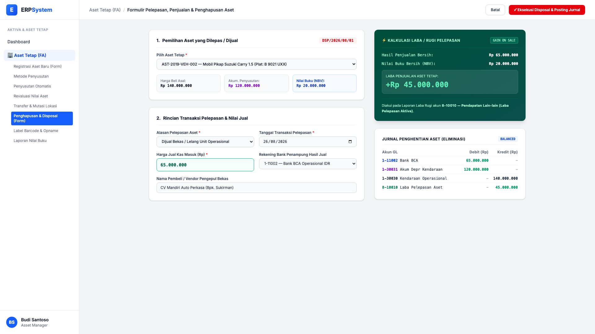
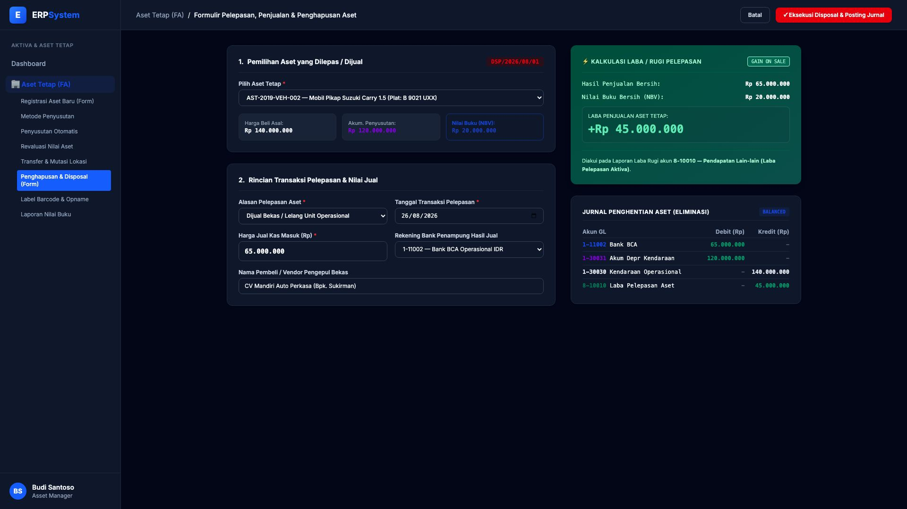

# 🎨 Design UI — Formulir Pelepasan & Penjualan Aset (Data Entry Screen)

> Mockup antarmuka **Formulir Pelepasan, Scrap, & Penjualan Aset Tetap (Fixed Asset Disposal Entry & Gain/Loss Simulation)**: desain *Split-Screen Form* dengan formulir input pelepasan di sebelah kiri (Pemilihan aset terdaftar, alasan *write-off* / lelang bekas, harga penjualan kas masuk, rekening penampung) dan *Kalkulator Laba/Rugi Pelepasan serta Pratinjau Jurnal Eliminasi Aset* di sebelah kanan pada modul `FA` (Aset Tetap / Fixed Assets) dalam ERP System.

---

## Light Mode

---

## Dark Mode

---

## 📝 Komponen & Fitur Formulir Input

1. **Panel Kiri — Formulir Transaksi Pelepasan (Disposal)**:
   - Pemilihan aset target (otomatis menampilkan harga perolehan historis Rp 140 Jt, akumulasi depr Rp 120 Jt, dan nilai buku Rp 20 Jt).
   - Dropdown Alasan Pelepasan: *Dijual Bekas / Lelang, Scrap Rusak Total, Hilang / Klaim Asuransi*.
   - Input Nilai Jual Bersih Kas Masuk & Pemilihan Rekening Bank Penampung Kas.

2. **Panel Kanan — Kalkulator Laba/Rugi & Jurnal Eliminasi Otomatis**:
   - **⚡ Kalkulasi Laba Penjualan**: Hasil Jual (Rp 65 Jt) - Nilai Buku (Rp 20 Jt) = **Laba Pelepasan Aset +Rp 45.000.000**.
   - **Jurnal Eliminasi 4-Baris (Balanced)**:
     - Debit: `1-11002 — Bank BCA` (Rp 65 Jt)
     - Debit: `1-30031 — Akum Depr Kendaraan` (Rp 120 Jt)
     - Kredit: `1-30030 — Kendaraan Operasional` (Rp 140 Jt)
     - Kredit: `8-10010 — Laba Pelepasan Aset` (Rp 45 Jt)
