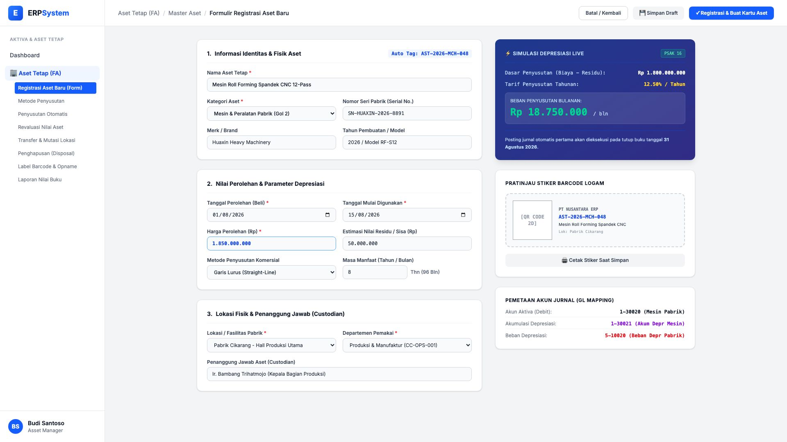
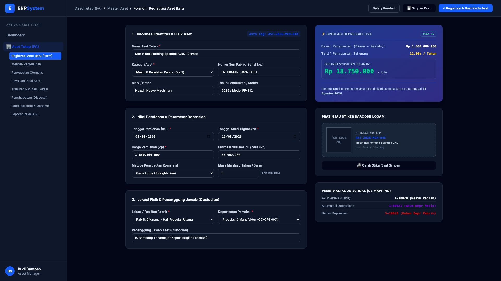

# 🎨 Design UI — Formulir Registrasi Aset Baru (Data Entry Screen)

> Mockup antarmuka **Formulir Registrasi & Kapitalisasi Aset Baru (Fixed Asset Data Entry & Live Simulation)**: desain *Split-Screen Form* dengan formulir input di sebelah kiri (Identitas fisik aset, nilai perolehan, masa manfaat, lokasi & *custodian*) dan *Live Preview & Kalkulator Depresiasi Otomatis* di sebelah kanan (Simulasi beban bulanan real-time, stiker barcode/QR plat logam, dan pemetaan akun GL) pada modul `FA` (Aset Tetap / Fixed Assets) dalam ERP System.

---

## Light Mode

---

## Dark Mode

---

## 📝 Komponen & Fitur Formulir Input

1. **Header Formulir & Aksi Penyimpanan**:
   - Status: Tag Otomatis `AST-2026-MCH-048`.
   - Tombol **"💾 Simpan Draft"**: Simpan sementara tanpa membuat kartu aset permanen.
   - Tombol **"✓ Registrasi & Buat Kartu Aset"** (*Primary Blue*): Validasi data, buat kartu aset, dan jadwalkan penyusutan.

2. **Panel Kiri — Formulir Input Data (Data Entry)**:
   - **Bagian 1: Identitas & Fisik**: Nama aset, kategori (Golongan Fiskal), nomor seri pabrik, merk, dan tahun model.
   - **Bagian 2: Nilai Perolehan & Finansial**: Tanggal beli, tanggal mulai dipakai, harga perolehan (Rp), estimasi nilai residu/sisa, metode penyusutan (Garis Lurus/Saldo Menurun), dan masa manfaat.
   - **Bagian 3: Lokasi & Penanggung Jawab**: Fasilitas pabrik/kantor, departemen/cost center, dan pegawai penanggung jawab (*Custodian*).

3. **Panel Kanan — Live Preview & Simulasi Cerdas (Real-Time Output)**:
   - **⚡ Simulasi Depresiasi Live**: Menghitung otomatis dasar penyusutan, tarif tahunan (12.50%), dan beban per bulan (Rp 18.750.000/bln) secara langsung saat kolom harga atau masa manfaat diubah.
   - **Pratinjau Stiker Barcode & QR**: Menampilkan tampilan fisik stiker tag logam tahan cuaca yang siap dicetak via printer barcode.
   - **Pemetaan Akun GL (GL Mapping)**: Otomatis menampilkan akun debit aktiva, akun akumulasi, dan akun beban depresiasi sesuai kategori aset yang dipilih.
