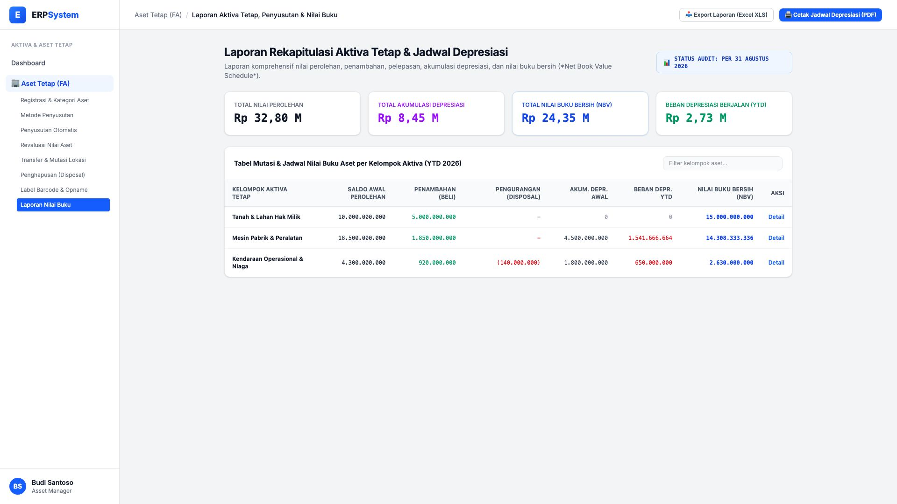
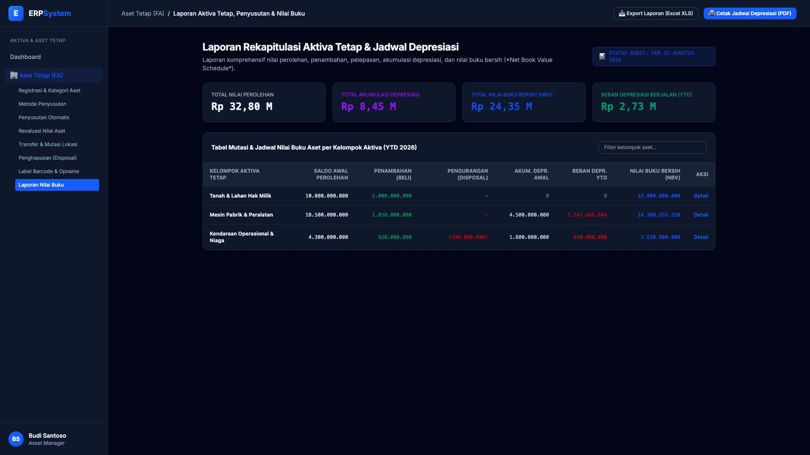

# 🎨 Design UI — Laporan Daftar Aset & Nilai Buku (Fixed Asset Schedule)

> Mockup antarmuka **Laporan Rekapitulasi Aktiva Tetap, Jadwal Penyusutan, & Nilai Buku Bersih (Fixed Asset Movement & Depreciation Schedule)**: agregasi saldo awal perolehan, penambahan aktiva dari pembelian, pengurangan dari pelepasan/disposal, beban depresiasi YTD, dan rekonsiliasi nilai buku bersih (*Net Book Value*) pada modul `FA` (Aset Tetap / Fixed Assets) dalam ERP System.

---

## Light Mode

---

## Dark Mode

---

## 📊 Komponen & Fitur Utama

1. **Header & Periode Jadwal Aset**:
   - Status Audit: 📊 **STATUS AUDIT: PER 31 AGUSTUS 2026**.
   - Tombol **"📥 Export Laporan (Excel XLS)"**: Unduh format kertas kerja audit aset tetap KAP.
   - Tombol **"🖨️ Cetak Jadwal Depresiasi (PDF)"** (*Primary Blue*): Laporan ringkasan lampiran SPT Tahunan PPh Badan.

2. **Ringkasan Nilai Neraca Aktiva (Stats Cards)**:
   - **Total Nilai Perolehan**: Rp 32,80 Miliar
   - **Total Akumulasi Depresiasi**: Rp 8,45 Miliar
   - **Total Nilai Buku Bersih (NBV)**: Rp 24,35 Miliar
   - **Beban Depresiasi Berjalan (YTD)**: Rp 2,73 Miliar

3. **Tabel Mutasi Aktiva & Depresiasi**:
   - Menampilkan: *Kelompok Aktiva Tetap, Saldo Awal Perolehan, Penambahan (Beli), Pengurangan (Disposal), Akum. Depr. Awal, Beban Depr. YTD, Nilai Buku Bersih (NBV), dan Tombol Detail*.
