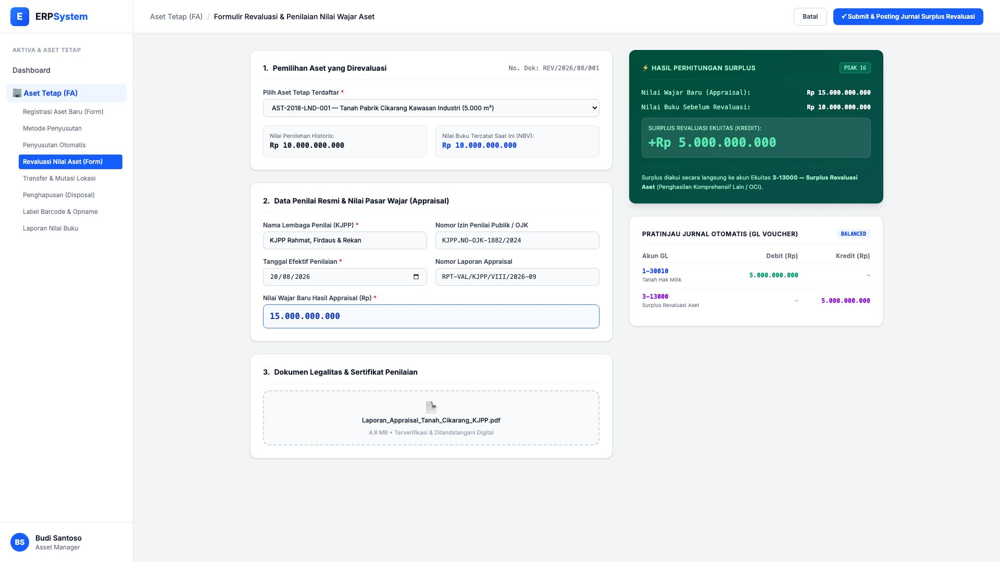
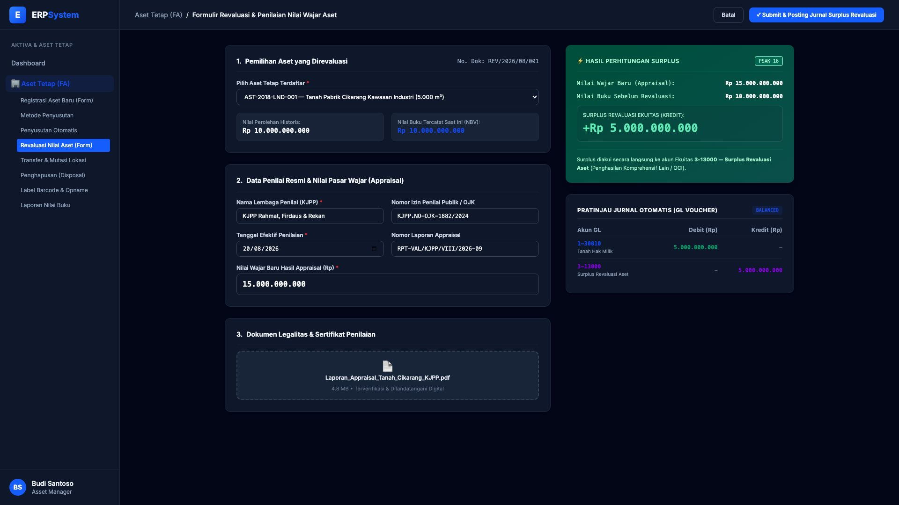

# 🎨 Design UI — Formulir Revaluasi Aset Tetap (Data Entry Screen)

> Mockup antarmuka **Formulir Revaluasi Nilai Wajar Aktiva (Fixed Asset Revaluation Entry)**: desain *Split-Screen Form* dengan formulir pengajuan appraisal di sebelah kiri (Pemilihan aset terdaftar, input lembaga KJPP, tanggal penilaian, nilai wajar appraisal baru) dan *Kalkulator Surplus Revaluasi & Live Jurnal Voucher Preview* di sebelah kanan pada modul `FA` (Aset Tetap / Fixed Assets) dalam ERP System.

---

## Light Mode

---

## Dark Mode

---

## 📝 Komponen & Fitur Formulir Input

1. **Panel Kiri — Formulir Pengajuan Appraisal**:
   - Pemilihan aset target dari direktori aktiva tetap (otomatis menarik harga perolehan historis & nilai buku saat ini).
   - Identitas Lembaga Penilai Publik Resmi (KJPP) & Nomor Izin OJK.
   - Input Nilai Wajar Baru Hasil Appraisal (Rp).
   - Upload Dokumen Laporan Appraisal Resmi (PDF).

2. **Panel Kanan — Kalkulator Surplus & Live Voucher Jurnal**:
   - **⚡ Perhitungan Surplus Revaluasi Ekuitas**: Real-time menghitung selisih nilai wajar baru vs nilai buku tercatat (+Rp 5.000.000.000).
   - **Pratinjau Jurnal Otomatis (GL Voucher)**: Debit Akun Aktiva Tanah `1-30010` dan Kredit Akun Modal Ekuitas `3-13000 — Surplus Revaluasi Aset (OCI)` dalam kondisi *Balanced*.
