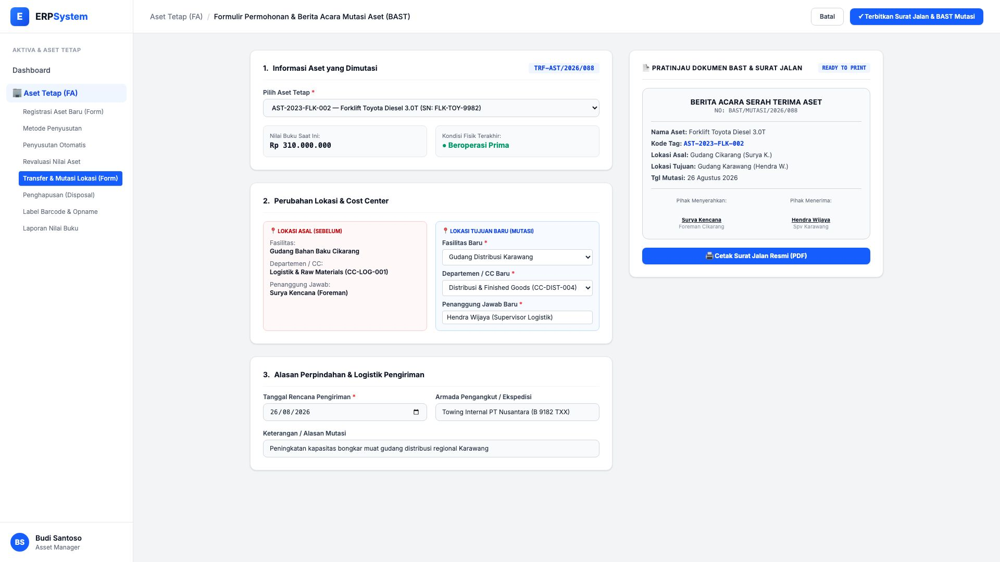
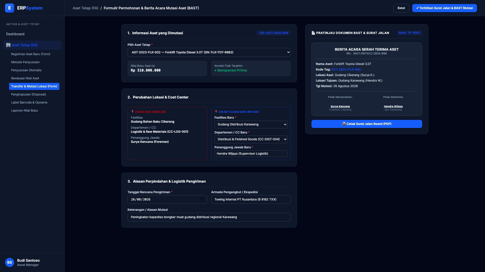

# 🎨 Design UI — Formulir Mutasi & Transfer Aset (Data Entry Screen)

> Mockup antarmuka **Formulir Permohonan & Serah Terima Mutasi Aset (Fixed Asset Transfer & Custody Handover)**: desain *Split-Screen Form* dengan formulir input mutasi di sebelah kiri (Pemilihan aset, perpindahan lokasi fisik asal vs tujuan, penanggung jawab *custodian* baru, alasan operasional) dan *Live Pratinjau Dokumen BAST Resmi & Surat Jalan Pengangkutan* di sebelah kanan pada modul `FA` (Aset Tetap / Fixed Assets) dalam ERP System.

---

## Light Mode

---

## Dark Mode

---

## 📝 Komponen & Fitur Formulir Input

1. **Panel Kiri — Formulir Pengajuan Mutasi**:
   - Pemilihan aset tetap yang akan dipindahkan (menampilkan nilai buku saat ini & status fisik).
   - Perbandingan berdampingan: *Lokasi Asal (Gudang Cikarang, CC-LOG-001, Surya K.)* vs *Lokasi Tujuan Baru (Gudang Karawang, CC-DIST-004, Hendra W.)*.
   - Rincian armada pengangkutan internal/ekspedisi dan estimasi jadwal tiba.

2. **Panel Kanan — Dokumen BAST & Surat Jalan Real-Time**:
   - Menampilkan layout format resmi Berita Acara Serah Terima Aset lengkap dengan data kedua belah pihak yang menyerahkan dan menerima.
   - Tombol cetak langsung dokumen Surat Jalan (PDF).
