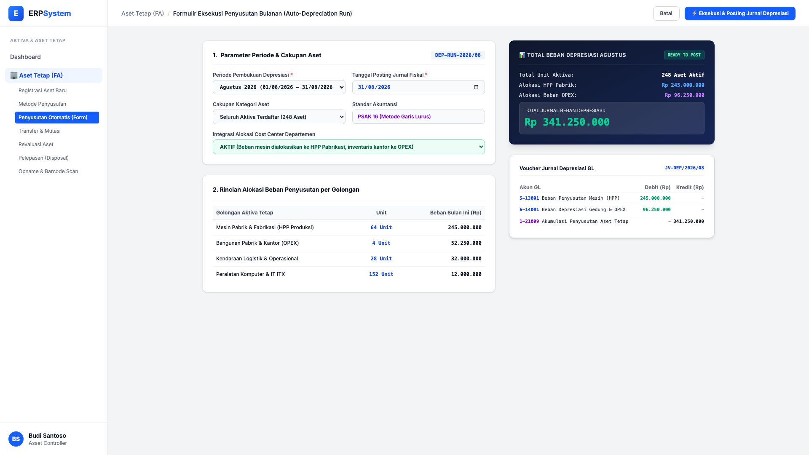
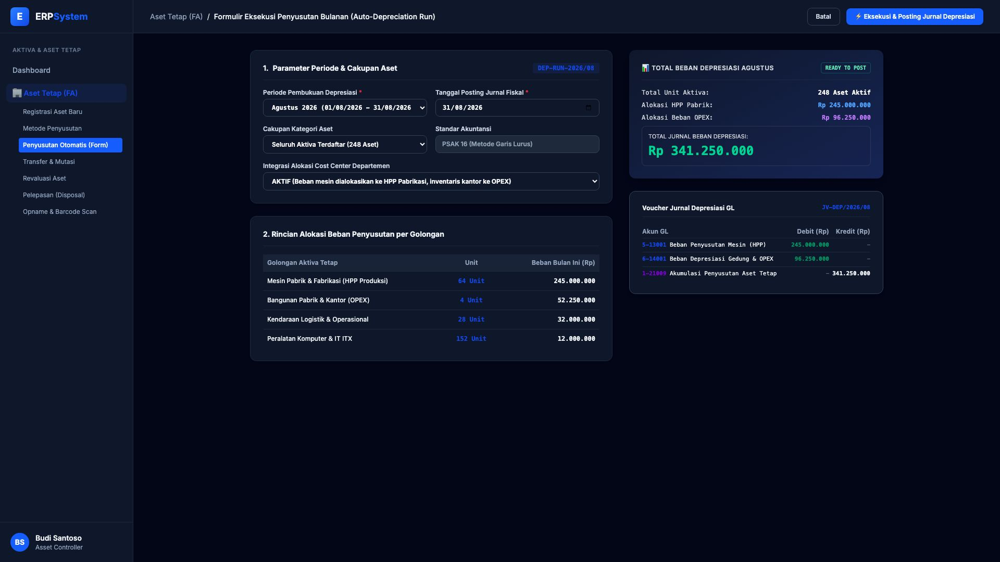

# 🎨 Design UI — Formulir Eksekusi Penyusutan Otomatis (Data Entry Screen)

> Mockup antarmuka **Formulir Eksekusi Penyusutan Massal Aset Tetap Bulanan (Monthly Auto-Depreciation Run Data Entry)**: desain *Split-Screen Form* dengan formulir input penyusutan di sebelah kiri (Periode Agustus 2026, tanggal cut-off 31/08/2026, cakupan 248 aktiva tetap, PSAK 16 Garis Lurus, integrasi alokasi Cost Center) dan *Live Ringkasan Alokasi Beban (HPP Pabrik Rp 245 Jt vs OPEX Rp 96,25 Jt &bull; Total Rp 341.250.000) & Voucher Jurnal Depresiasi GL `JV-DEP/2026/08`* di sebelah kanan pada modul `FA` (Aset Tetap / Fixed Assets) dalam ERP System.

---

## Light Mode

---

## Dark Mode

---

## 📝 Komponen & Fitur Formulir Input

1. **Panel Kiri — Formulir Parameter Eksekusi Penyusutan**:
   - Periode Fiskal: `Agustus 2026 (01/08/2026 - 31/08/2026)`.
   - Tanggal Posting: `2026-08-31` &bull; Standar: **PSAK 16 Garis Lurus**.
   - Cakupan: **Seluruh 248 Aset Aktif** &bull; Cost Center: **Alokasi Otomatis HPP vs OPEX**.

2. **Panel Kanan — Total Beban & Jurnal Depresiasi GL**:
   - Beban Mesin Pabrik (HPP Produksi): **Rp 245.000.000**.
   - Beban Gedung & Komputer (OPEX Kantor): **Rp 96.250.000**.
   - **Total Jurnal Depresiasi: Rp 341.250.000**.
   - Jurnal Otomatis `JV-DEP/2026/08`: Debit Beban Penyusutan vs Kredit Akumulasi Penyusutan Aset Tetap.
